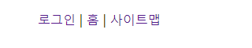
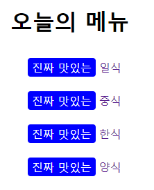

# 가상요소 ::before, ::after

### 1. 가상요소

#### 1) 가상클래스

- **별도의 class를 지정하지 않아도 지정한 것처럼** 요소를 선택할 수 있다.

#### 2) 가상 요소

- 가상클래스처럼 선택자(selector)에 추가되며, **존재하지 않는 요소를 존재하는 것처럼** 부여하여 문서의 특정 부분 선택이 가능하다.

#### 예시

```html
<ul>
    <li>이 : 이발소</li>
    <li>환 : 환자</li>
</ul>
```

```css
.test1 ul li:first-child { font-weight : bold;}
.test1 ul li::first-letter { fonst-size : 30px; color:blue;}
```

> `:first-child` (가상클래스) : class를 지정하지 않아도 `li`의 첫번째 자식요소를 선택하여 제어
>
> `::first-letter` (가상요소) : `li`내의 첫번째 글자를 감싸고 있는 요소가 없어도 제어할 수 있다.


#### 3) 대표적인 가상 요소

- `::first-line` : 요소의 텍스트에서 첫 줄에 스타일을 적용
- `::first-letter` : 요소의 첫 번째 글자에 스타일을 적용
- `::before` : 요소의 컨텐츠 시작부분에 생성된 **컨텐츠**를 추가
- `::after` : 요소의 컨텐츠 끝부분에 생성된 **컨텐츠**를 추가
- `::selection` : 요소의 텍스트에서 사용자에 의해 선택(드래그)된 영역의 속성을 변경
- `::placeholder` : `Input` 필드에 힌트 텍스트에 스타일 적용


### 2. `::before` , `::after`

> `::before` 와 `::after` 를 쓸 땐 `content` 라는 속성이 꼭 필요하다.


#### 1) `content = "" `

> `::before` 와 `::after` 와 함께 쓰이는 `content` 는 `가짜` 속성이다.
>
> - HTML 문서에 정보로 포함되지 않은 요소를 CSS에서 새롭게 생성시켜주기 때문이다.


#### 2) `content` 를 쓸때 대표적으로 사용되는 속성

- `normal` : 아무것도 표시하지 않는 기본값
- `string` :문자열 생성
- `image` 이미지나 비디오를 불러온다. 크기조절 불가능
- `counter` : 순서를 매길 수 있다. `counter-increment` , `counter-reset` 함께 사용
- `none` : 아무것도 표시하지 않는다.
- `attr` : 해당속성의 속성값 표시


#### 3) 활용법

- 구분바 넣기

```html
<!--html--> 
<div id="content">
      <ul class="test">
        <li><a href="">로그인</a></li>
        <li><a href="">홈</a></li>
        <li><a href="">사이트맵</a></li>
      </ul>
</div>
```

```css
/* CSS*/
.test li {
        float: left;
        margin-right: 5px;
}
.test li::after {  /* li 요소 뒤에 content : "|" 를 추가한다. */
        padding-left: 5px;
        content: "|";
}
.test li:last-child::after { /* 마지막 li에는 추가한 content를 없앤다. */
        content: "";
}
```



- 앞, 뒤에 추가 정보 넣기

```html
<!--html-->
 <h1>오늘의 메뉴</h1>
    <ul class="test">
      <li><a href="">일식</a></li>
      <li><a href="">중식</a></li>
      <li><a href="">한식</a></li>
      <li><a href="">양식</a></li>
    </ul>
```

```css
.test li {
        line-height: 3;
      }
.test li a::before { /* a 요소 앞에 "진짜 맛있는" 이라는 content를 추가한다. */
        content: "진짜 맛있는";
        width: 40px;
        padding: 3px 6px;
        margin: 0 5px;
        border-radius: 4px;
        background: blue;
        text-align: center;
        color: white;
}
```

