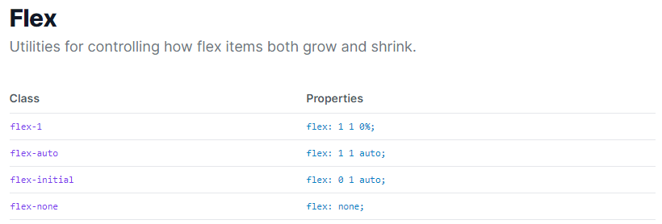
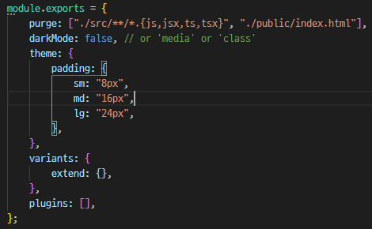
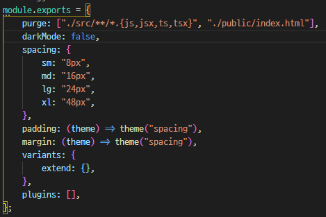

# Tailwind CSS

**Tailwind CSS**는 Utility-First 컨셉을 가진 CSS 프레임워크로, 부트스트랩과 유사하게 `m-1`, `flex` 같은 방식으로 미리 세팅된 유틸리티 클래스를 활용하여 HTML 코드 내에서 스타일링 할 수 있다.

> ※ Utility-First CSS 는 각 class가 담당할 스타일을 미리 정의하고 필요한 class 들을 조합해서 적용하는 식으료 사용한다.


### 구조

```css
.{property}{side}-{size}
```

위와 같은 형태로 class 이름을 갖는다.


#### 예시

**margin**과 **padding**으로 간단한 예시를 들어보면,

- `mt-5` : margin-top을 5px로 정의된 클래스를 적용한다.
- `pb-3` : padding-bottom을 3px로 정의된 클래스를 적용한다.
- `px-2` : x축 기준 padding을 2px로 정의된 클래스를 적용한다.


### 장점

- 커스텀이 쉽고 확장에 용이하다.

- 플러그인을 추가하거나 직접 제작할 수 있다.

- 문서화도 잘 되어 있다.[Tailwind CSS docs](https://tailwindcss.com/docs)

   

- `tailwind.config.js`에서 커스텀하여 사용할 수 있다.

  - **theme.padding** 사용

     

  - **theme.spacing** 사용

    padding 옵션을 직접 사용하지 않고 spacing 속성을 통해 적용되도록 하는 방법이다.

     


### 반응형 적용

**Tailwind CSS**에는 스크린의 크기에 따라 기본적으로 4개의 break point가 적용되어 있다.

```html
<div class="bg-red-500 sm:bg-green-500 md:bg-blue-500 lg:bg-pink-500 xl:bg-black w-20 h-20"></div>
```


### 참고 사이트

[Tailblocks](https://tailblocks.cc/)