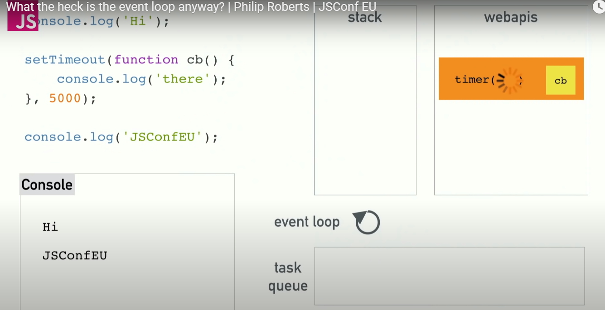

# 자바스크립트 : 싱글스레드

> 싱글 스레드 : 하나의 프로그램은 동시에 하나의 코드만 실행할 수 있다.


### Call Stack

- Call Stack이 하는 일
  - Call stack은 data structure로 실행되는 순서를 기억한다.
  - 함수를 실행하려면 스택에 해당하는 함수를 집어넣고 함수에서 리턴이 일어나면 스택의 가장 위쪽에서 해당 함수를 꺼낸다.

```javascript
function multiply(a, b) {
    return a * b;
}

function square(n) {
    return multiply(n, n);
}

function printSquare(n) {
    var squared = square(n);
    console.log(squared);
}

printSquare(4);
```

- 실행 순서
  - 코드 자체를 말하는 메인함수를 스택에 집어넣는다.
  - printSquare(4)를 호출하고 스택에 printSquare함수가 추가된다.
  - 그럼 printSquare함수 안에서 square(4) 함수가 호출되고 스택에 square함수가 추가된다.
  - square함수는 multiply(4, 4)를 호출하고 스택에 multiply함수가 추가된다.
  - `return 4 * 4;`구문을 만나서 곱한 결과를 반환한다.
    - 무엇인가를 리턴할때마다 스택에 맨 위에 있는 것을 꺼낸다.
  - multiply함수에서 square함수로 리턴되고 다시 printSquare까지 돌아온다.
  - `console.log(16)`을 실행하고 보이지는 않지만 암묵적으로 리턴을 한다.


### 블로킹, 블로킹현상

- 느리게 동작하는 코드
- 느린 동작이 스택에 남아있는것을 보통 블로킹이라 한다.


### Async Callbacks & The Call Stack

```javascript
console.log('hi');

setTimeout(function() {
    console.log('there');
}, 5050);

console.log('JSConf')
```

- 실행순서

  - main함수가 실행되고 `console.log('hi')`를 출력하고
  - `setTimeout`함수를 실행한다.
  - 바로 실행되지 않고 5초 안에 실행된다.(setTimeout 함수 때문)
    - 스택에 추가되지 않고 사라져 버린다.
  - `console.log('JSConf')` 가 출력된다.
  - 5초 후 `console.log('there')` 가 스택에 나타난다

  

  &#10148; 이벤트 루프와 동시성이 역할을 하게 된다.

  - 자바스크립트는 싱글스레드로 하나 이상의 일을 할 수 없다.
    - 브라우저가 Web API와 같은 것들을 제공하기 때문에 가능하다.
    - 자바스크립트에서 호출할 수 있는 스레드를 효과적으로 지원
  - setTimeout 함수가 실행되면 setTimeout 콜백함수를 스택에 저장
    - 브라우저(Web Api)가 타이머를 실행시키고 카운트 다운을 시작
    - setTimeout에 대한 호출은 완료되었고 스택에서 setTimeout함수를 지울 수 있다.
    - 이제 Web Api에서 실행되고 있는 타이머가 남았다.
    - Web Api에서 작동이 완료되면 콜백함수를 테스크 큐에 밀어 넣는다.
      - event loop의 역할은 콜 스택과 테스크 큐를 주시하는 것
      - 스택이 비어있으면 큐의 첫번째 콜백을 스택에 쌓아준다.
    - 스택이 비어있는 것을 확인하고 테스크 큐에 있는 콜백을 스택에 넣어준다.
    - `console.log('there')`이 실행된다.




# 유동적인 UI를 만들어라

#### 이미지 처리나 애니메이션이 너무 잦아졌을때 큐관리에 주의를 기울여야한다.


[출처]( http://www.youtube.com/watch?v=8aGhZQkoFbQ&ab_channel=JSConf)


