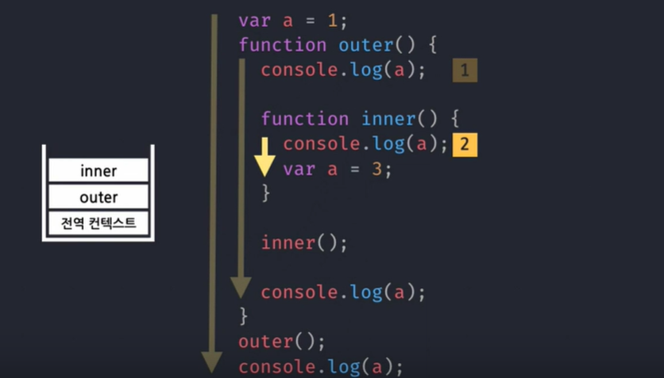
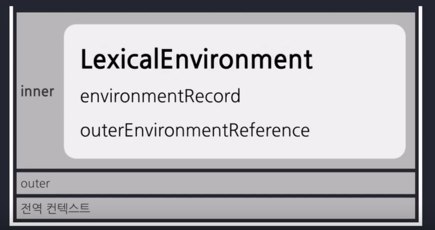
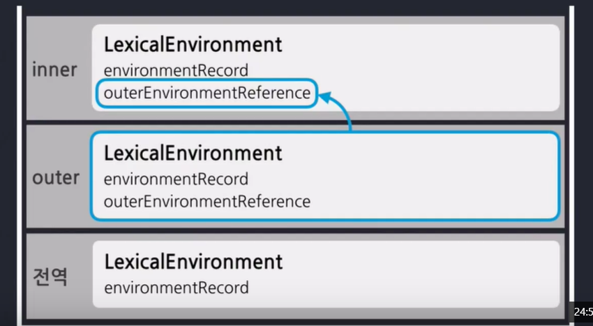
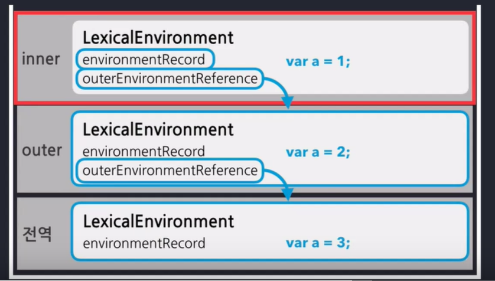
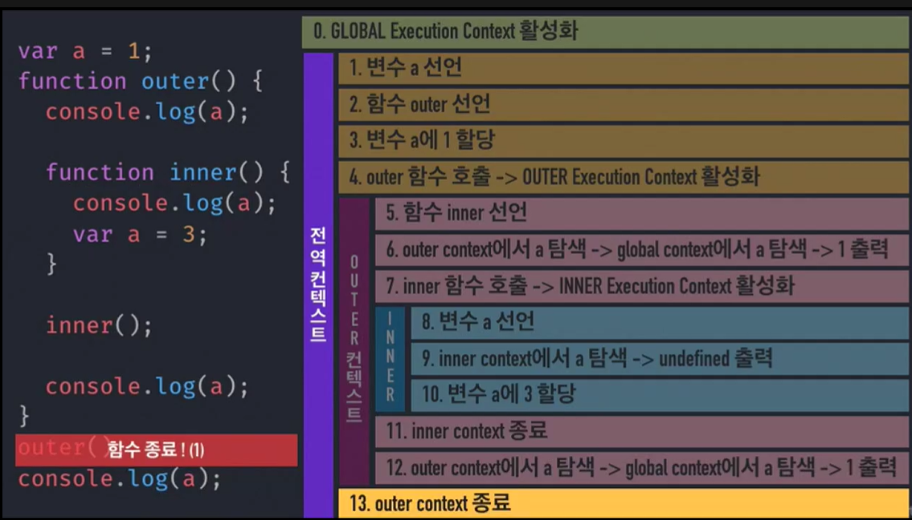

# Execution Context(실행 맥락/환경/상황) - 실행 콘텍스트

- 실행에 필요한 코드 흐름상의 배경이 되는 조건 / 환경

- 동일한 조건 / 환경을 지니는 코드 뭉치

==> **함수**를 실행할때 필요한 조건 / 환경정보**를 담은 객체**


```javascript
var a = 1;
function outer() {
    console.log(a); // 실행 순서 (1)
    
    function inner() {
        console.log(a); // 실행 순서 (2)
        var a = 3;
    }
    
    inner();
    
    console.log(a); // 실행 순서 (3)
}
outer();
console.log(a); // 실행 순서 (4) 
```


## call stack

  현재 어떤 함수가 동작하고 있는지, 다음에 어떤 함수가 호출되어야 하는지 등을 제어하는 자료구조다.

 

 


## LexicalEnvironment (어휘적 / 사전적 환경)


### environmentRecord : 현재 문맥의 식별자 정보

 = **HOISTING(호이스팅)** : 식별자 정보를 끌어올린다.

```javascript
console.log(a());
console.log(b());
console.log(c());

function a() {
    return 'a';
} // 함수 전체를 HOISTING
// 아래는 var b; var c; 를 HOISTING
var b = function bb(){
    return 'bb';
}
var c = function() {
    return 'c';
}

// HOISITNG 후의 코드
function a(){
    return 'a';
}
var b;
var c;

console.log(a());
console.log(b());
console.log(c());

b = function bb(){
    return 'bb';
}
c = function() {
    return 'c';
}

// environmentRecord는 아래와 같다
environmentRecord
{
    function a() {...},
    b,
    c
}
```


### outerEnvironmentReference 

 : 현재 문맥에 관련 있는 **외부** 식별자 정보

 


#### Scope Chain

 : 자신한테 가장 가까운 것에 접근(오버라이트는 아니고 가린 것)

 


### 실행 과정

 


---

출처 : [JS - Flow](https://www.inflearn.com/course/%ED%95%B5%EC%8B%AC%EA%B0%9C%EB%85%90-javascript-flow/dashboard)

