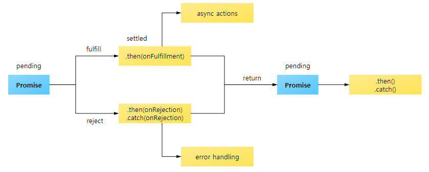

# Promise

### Promise 란?

- 자바스크립트 비동기 처리에 사용되는 객체 
  - 비동기처리 
    - 특정 코드의 실행이 완료될 때까지 기다리지 않고 다음코드를 수행하는 자바스크립트 특성
- 서버에서 받아온 데이터를 화면에 표시할 때 사용
  - 데이터를 받아오기도 전에 화면에 데이터를 표시하려고하면 오류가 발생
    - 이와 같은 문제점을 해결하기 위한 방법 중 하나가 Promise다.


### Promise 코드 - 기초

```javascript
function getData(callbackFunc) {
    $.get('url/products/1', function(response){
        callbackFunc(response); //서버에서 받은 데이터 response를 callbackFunc() 함수에 넘겨준다.
    });
}

getData(function(tableData) {
    console.log(tableData); // $.get()의 response 값이 tableData에 전달됨.
}
```

- 위 코드는 jQuery의 ajax 통신 API를 이용하여 지정된 url에서 1번 데이터를 받아오는 코드
- 위의 코드에 프로미스를 적용하면

```javascript
function getData(callback) {
    //new Promise() 추가
    return new Promise(function(resolve, reject) {
        $.get('url/products/1', function(response){
            //데이터를 받으면 resolve() 호출
            resolve(response);
        });
    });
}

//getData()의 실행이 끝나면 호출되는 then()
getData().then(function(tableData){
    //resolve()의 결과 값이 여기로 전달됨
    console.log(tableData); //$.get()의 response 값이 tableData에 전달됨
});
```

- 위에서 콜백함수로 처리하던 구조에서 `new Promise()` , `resolve()` , `then() ` 와 같은 Promise Api를 사용한 구조로 바뀌었다.


### 프로미스의 3가지 상태(states)

- 상태 : 프로미스의 처리과정을 의미

- `new Promise()` 로 생성하고 종료될 때까지 3가지 상태를 갖는다.

  - Pending(대기) : 비동기 처리 로직이 아직 완료되지 않은 상태
  - Fulfilled(이행) : 비동기 처리가 완료되어 프로미스가 결과 값을 반환해준 상태
  - Rejected(실패) : 비동기 처리가 실패하거나 오류가 발생한 상태

  

- Pending(대기)

  - `new Promise();` 메서드를 호출하면 대기 상태가 된다.
  - `new Promise()` 메서드를 호출할 때 콜백 함수를 선언할 수 있고, 인자는 `resolve` 와 `reject`이다.

  ```javascript
  new Promise(function(resolve, reject) {
      // ...
  });
  ```

  

- Fulfilled (이행) : 이행 상태를 다르게 표현해보면 '완료'이다.

  - 콜백함수의 인자 `resolve` 를 아래와 같이 실행하면 이행 상태가 된다.

  ```javascript
  new Promise(function(resolve, reject) {
      resolve();
  });
  ```

  - 이행상태가 되면 아래와 같이 `then()` 을 이용하여 처리 결과 값을 받을 수 있다.

  ```javascript
  function getData() {
      return new Promise(function (resolve, reject){
          var data = 100;
          resolve(data);
      });
  }
  
  // resolve()의 결과 값 data를 resolvedData로 받음.
  getData().then(function(resolvedData){
      console.log(resolvedData); //위에서 data변수에 저장한 100 출력
  })
  ```


- Rejected(실패)

  - 콜백 함수 인자 중 `reject`를 호출하면 Rejected 상태가 된다.

  - 실패 상태가 되면 실패한 이유(실패 처리의 결과값)을 catch()로 받을 수 있다.

  ```javascript
  function getData() {
      return new Promise(function(resolve, reject) {
          reject(new Error("Request is failed"));
      });
  }
  
  // reject()의 결과 값 Error를 err에 받음
  getData().then().catch(function(err){
      console.log(err); // Error : Request is failed
  });
  ```

  

- Promise 처리 흐름



- Promise 간단 예제

```javascript
function getData() {
  return new Promise(function(resolve, reject) {
    $.get('url 주소/products/1', function(response) {
      if (response) {
        resolve(response);
      }
      reject(new Error("Request is failed"));
    });
  });
}

// 위 $.get() 호출 결과에 따라 'response' 또는 'Error' 출력
getData().then(function(data) {
  console.log(data); // response 값 출력
}).catch(function(err) {
  console.error(err); // Error 출력
});
```

> 서버에서 제대로 응답을 받아오면 `resolve()` 메서드를 호출하고 
>
> 응답이 없으면 `reject()` 메서드를 호출한다.
>
> 호출된 메서드에 따라 `then()` 이나 `catch()` 로 분기하여 응답한다.


- 에러 처리 방법
  - `then()`의 두번째 인자로 에러를 처리하는 방법

  ```javascript
  getData().then(function(){
      //...
  }, function(err){
      console.log(err);
  });
  ```

  - `catch()` 를 이용하는 방법

  ```javascript
  getData().then().catch(function(err) {
      console.log(err);
  });
  ```

  > 에러처리는 가급적 `catch()` 를 사용할 것
  >
  > `then()` 에서오류가 나는 경우 제대로 오류를 잡아내지 못하기 때문.

