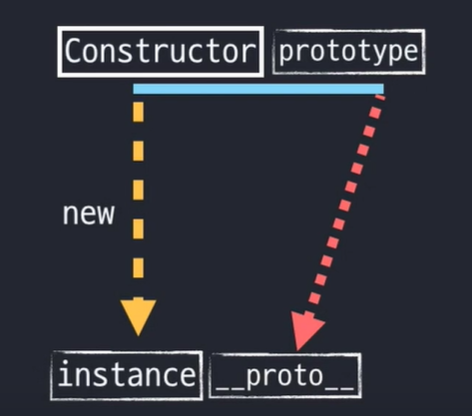
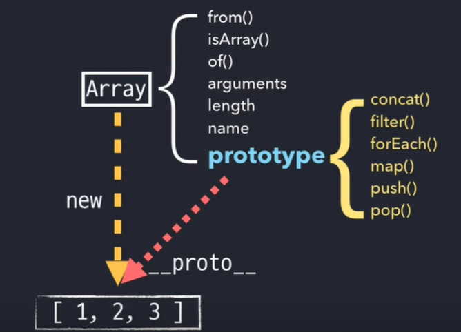
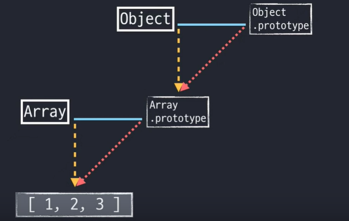

# Prototype ( JS Flow )


## prototype, constructor, __proto__

 

> `__proto__`는 생략이 가능하다


 


```javascript
function Person(n, a) {
    this.name = n;
    this.age = a;
}

var gomu = new Person('고무곰', 30);

var gomuClone1 = new gomu.__proto__.constructor('고무곰_클롭1', 10);
var gomuClone2 = new gomu.constructor('고무곰_클론2', 25);

var gomuProto = Object.getPrototypeOf(gomu);
var gomuClone3 = new gomuProto.constructor('고무곰_클론3', 20);

var gomuClone4 = new Person.prototype.constructor('고무곰_클론4', 15);
```


## 메소드 상속 및 동작원리

```javascript
function Person(n, a) {
    this.name = n;
    this.age = a;
}

var gomu = new Person('고무곰', 30);
var iu = new Person('아이유', 25);

gomu.setOlder = function() {
    this.age += 1;
}
gomu.getAge = function() {
    return this.age;
}
iu.setOlder = function() {
    this.age += 1;
}
iu.getAge = function() {
    return this.age;
}

// 아래와 같이 변경 (반복을 줄임)
function Person(n, a) {
    this.name = n;
    this.age = a;
}
Person.prototype.setOlder = function() {
    this.age += 1;
}
Person.prototype.getAge = function() {
    return this.age;
}

var gomu = new Person('고무곰', 30);
var iu = new Person('아이유', 25);
/*
	Person.prototype.age = 100
	gomu.__proto__.setOlder();
	gomu.__proto__.getAge(); // 101
		// this가 가르키는 것의 차이
	gomu.setOlder();
	gomu.getAge(); // 31
*/
```


## Prototype Chaining

 

### Object.prototype의 메소드

- `hasOwnProperty()`
- `toString()`
- `valueOf()`
- `isPrototypeOf()`


```javascript
var arr = [1, 2, 3];
console.log(arr.toString()); // 1, 2, 3

arr.toString = function() {
    return this.join('_');
}
console.log(arr.toString()); // 1_2_3

console.log(arr.__proto__toString.call(arr)); // 1, 2, 3

console.log(arr.__proto__.__proto__.toString.call(arr)); // [object Array] Object prototype에 있는 메소드

Array.prototype.toString = function() {
    return '[' + this.join(', ') + ']';
}

console.log(arr.toString()); // [1, 2, 3]

console.log(arr.__proto__toString.call(arr)); // [1, 2, 3]
```