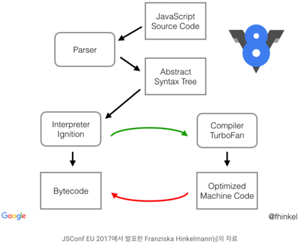

# V8

> 구글이 제공하는 강력한 오픈소스 자바스크립트 엔진


## 자바스크립트 엔진이란?

  자바스크립트 코드를 마이크로프로세서가 이해할 수 있는 더 낮은 수준의 언어 혹은 기계어로 변환해주는 역할을 한다.  Rhino, JavaScriptCore, SpiderMonkey와 같은 다양한 종류의 자바스크립트 엔진이 존재한다. 이 엔진들은 **ECMAScript** 표준을 따른다. **ECMAScript**는 스크립팅 언어를 위한 표준을 정의한다. 이러한 표준은 언어가 어떻게 동작할지, 어떤 특성을 가져야 하는지 정의한다.


## V8엔진 특징

 

- **V8**은 Google Chrome과 NodeJS에서 사용되고 있는 자바스크립트 엔진이다.
- C++로 작성되었고 고성능의 자바스크립트 전용 웹 어셈블리 엔진이다.
- 일반적으로 자바스크립트 엔진은 코드 한 줄을 해석하고 바로 실행하는 인터프리터 형식이지만, **V8 엔진**은 자바스크립트 코드를 바이트코드로 컴파일하고 실행하는 방식을 사용한다.


## V8 엔진 동작 과정

 

### 소스코드 파싱

  자바스크립트 소스코드를 먼저 가져와서 Parser에게 넘기면, 소스코드를 분석한 후 AST(Abstract Syntax Tree, 추상 구문 트리)로 변환한다.  **AST**는 컴파일러에서 널리 사용되는 자료 구조인데, 소스 코드를 컴퓨터가 알기 쉽게 **구조화**한다고 생각하면 된다.

  예를 들면 아래의 코드와 같이 해당 함수가 AST 트리 형태처럼 의미 있는 Tree 형태로 변환한다. 실제로는 각 어휘와 문법을 모두 해석하고 파싱 하게 되므로 실제 파서 내부는 더 많은 동작을 하게된다.

```js
function hello(name) {
    return 'Hello, ' + name;
}

--- 구조화된 AST

{
    type: 'FunctionDeclaration',
    name: 'hello',
    arguments: [
        {
            type: 'Variable',
            name: 'name'
        }
    ]
    // ...
}
```

  이렇게 파싱되어 만들어진 **AST**는 **Ignition**으로 넘어가게 된다.


### Ignition(바이트 코드로 변환)

####  Ignition

  자바스크립트 코드를 바이트 코드로 변환하는 인터프리터다. 원본 소스코드보다 컴퓨터가 해석하기 쉬운 바이트 코드로 변환하여, 수시로 코드를 파싱하는 작업을 최소화하고 코드의 양도 줄임으로써 메모리 공간도 효율적으로 관리할 수 있다.


  **자바스크립트**는 정적 타이핑 언어가 아니라 **동적 타이핑** 언어라서 소스코드가 실행되기 전에는 알 수 없는 값들이 너무 많아 최적화가 힘들다는 단점이 있다. 그래서 코드 한줄 한줄 실행될 때마다 해석하는 인터프리트 방식으로 다음과 같이 세가지 이점을 가져가고자 했다.

- **메모리 사용량 감소** : 자바스크립트 코드에서 기계어로 컴파일하는 것보다 바이트 코드로 컴파일하는 것이 더 편하다.
- **파싱 시 오버헤드 감소** : 바이트 코드는 간결하기 때문에 다시 파싱하기 편하다.
- **컴파일 파이프라인의 복잡성 감소** : **TurboFan**을 통한 Optimizing 혹은 Deoptimizing 처리 시에도 바이트 코드가 편하다.


### TurboFan(자주 사용하는 바이트코드를 컴파일)

####  TurboFan

​    **TurboFan**은 5.9버전 이전에 사용되었던 ~~Crankshaft~~를 완전히 대체한 최적화 담당 컴파일러다. **TurboFan**은 바이트코드로 수시로 변환하는 과정을 최소화하기 위해 사용된다. **V8**은 런타임 중 **Profiler**에게 함수나 변수들의 호출 빈도와 같은 데이터를 모으게 한다. 이렇게 모인 데이터를 이용하여 **TurboFan**이 기준에 맞는 코드를 가져와서 최적화 시킨다.

