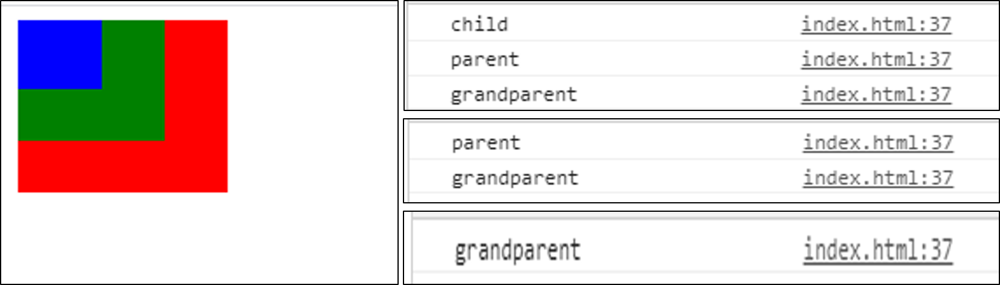

# 자바스크립트 이벤트의 동작

### 1. 이벤트 등록

> 자바스크립트에서는 이벤트 리스너를 통해 사용자의 특정 동작과 그 동작이 발생했을 때 발생시킬 이벤트를 함수로 표현한다.

```javascript
window.onload = function() {
    alert("Hello World");
};
```

- 위 함수는 window가 onload 됐을 때 실행된다.


```javascript
var div = document.querySelector('div');
div.addEventListener('click', function(){
    console.log("hi")
});
```

- 위 함수는 div가 클릭되었을 때 hi를 출력한다.


### 2. 이벤트 버블링 & 캡쳐링

> 이벤트 버블링 : 어떤 이벤트가 발생되었을 때 해당 이벤트가 발생된 부모요소를 통하여 최상위 요소까지 이벤트가 전달되는 현상

```html
<!DOCTYPE html>
<html>
<head>
  <meta charset="utf-8">
  <meta name="viewport" content="width=device-width">
  <title>JS Bin</title>
  <style>
  div.grandparent{
  background-color:red;
  width:100px;
  height:100px;
}

div.parent{
  background-color:green;
  width:70px;
  height:70px;
}

div.child{
  background-color:blue;
  width:40px;
  height:40px;
}
  </style>
</head>
<body>
  <div class="grandparent">
        <div class="parent">
            <div class="child">
            </div>
        </div>
    </div>
  <script>
    var elements = document.querySelectorAll('div');
	elements.forEach(function(i){
    	i.addEventListener('click', function(event){
        console.log(event.currentTarget.className);
    	});
	});
  </script>
</body>
</html>
```

> `<script>` 안에 설정은 모든 `<div>` 태그에 눌렀을 때 해당 영역의 클래스 이름을 출력하는 이벤트를 추가하는 설정이다.

> 여기서 `child` 영역을 눌렀을때 출력창에 `child => parent => grandparent` 순서로 발생하는 것을 볼 수 있다. 
>
> 
>
> 이벤트 캡쳐링은 이와 반대로 가장 상위 요소부터 이벤트 객체를 찾아가는 현상이다.
>
> - 이 설정을 위해선 `addEventListener` 안에 `capture:true` 를 넣으면 된다.(default는 false이다.)


### 3. 이벤트 위임

> 이벤트 버블링과 캡쳐링 특성을 이용하면 여러개의 요소가 있을 때 각각의 요소에 이벤트를 일일히 지정할 필요 없이 부모 요소에 이벤트를 하나만 주어 코드의 재사용성을 높이고 메모리를 절약할 수 있다.

```html
<ul id="parent-list">
    <li id="1">Item 1</li>
    <li id="2">Item 2</li>
    <li id="3">Item 3</li>
    <li id="4">Item 4</li>
    <li id="5">Item 5</li>
    <li id="6">Item 6</li>
</ul>

<script>
	document.getElementById("parent-list").addEventListener("click", function(e) {
        if(e.target && e.target.nodeName == "LI"){
            console.log(e.target.id);
        }
    });
</script>
```

> 위 코드의 동작은 해당 `li` (Item)을 클릭했을 때 그 `li`의 id 값을 반환한다.
>
> `<script>` 코드에서 보면 이벤트는 각 `li` 가 아닌 `ul` 태그에 준것을 확인할 수 있다.


### 4. 이벤트 객체

- 이벤트 객체 : 이벤트가 일어나는 요소 그자체를 의미한다.

  - 앞의 코드에서 `e.target` 이 바로 이벤트 객체를 나타낸다.

- `event.target` 과 `event.currentTarget` 의 차이

  - `event.currentTarget` 은 이벤트가 걸려있는 위치를 반환한다. 이벤트 생성 위치.

    - 위의 코드에서는 `ul` 태그

  - `event.target` 은 실제 이벤트가 발생하는 위치, 내가 클릭한 요소를 반환한다.

    - 위의 코드에서는 `li` 태그

    