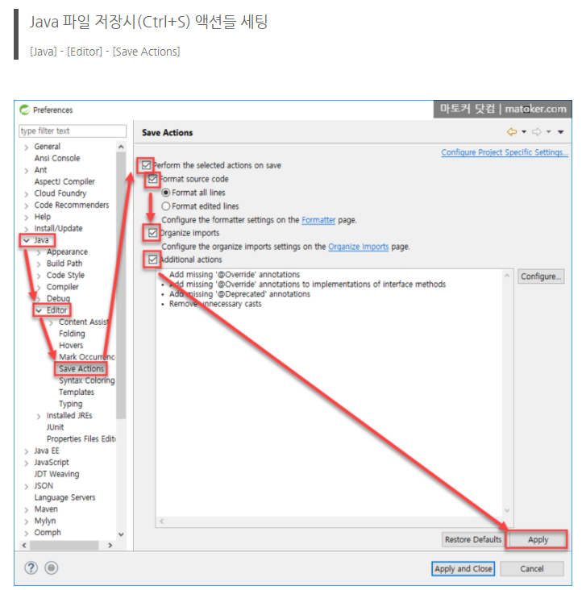
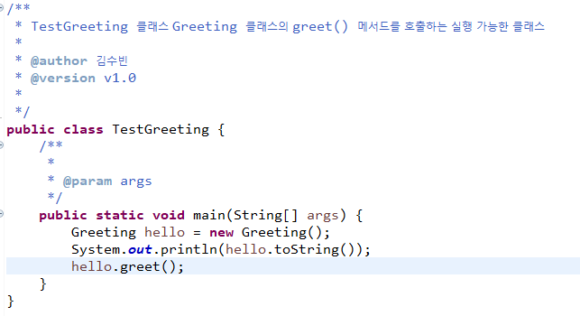

# 20.08.31

###  개발 환경 설정




### overriding 규칙

- 재정의 하는 메서드의 선언부는 반드시 같아야 한다.(return type, method name)
- 구현부는 달라야 한다
- @override 어노테이션은 컴파일 타임에 메서드 재정의 규칙을 준수 했는지 체크해주는 역할


> super : 부모 클래스를 가리키는 키워드
>
>  this : 자기 자신을 가리키는 키워드


#### 주석




#### 정수형 literal의 데이터 타입은 int  =>  연산 후 결과가 int

```java
short result = (short) (n1 + n2); //type casting - 형변환
```


### overloading :  method 중복정의

- 같은 클래스 내부에서 메서드 명은 같고 아규먼트 타입은 반드시 달라야 한다.
- 리턴 타입은 같을 수 있고 다를 수 있다.
- method overloading의 장점 : 인터페이스가 간단(단순)해지는 장점