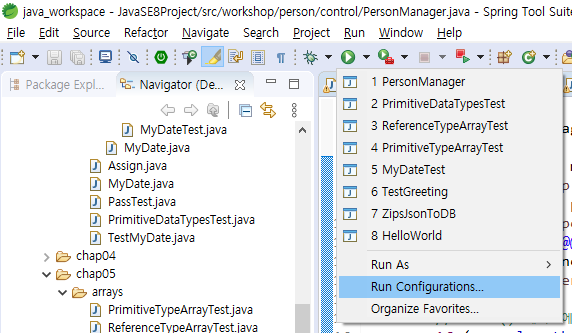
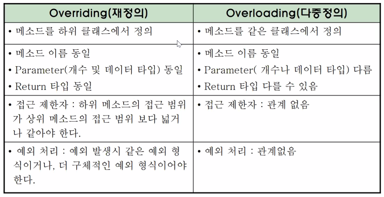

# 20.09.01

#### main() 메서드에 아규먼트가 없는 경우

```java
if(args.length < 1){
    System.exit(-1);
}
```

- main()에 argument 넣어서 실행하는 방법




- Scanner 객체 사용하기

```java
Scanner scanner = new Scanner(System.in);
System.out.println("성별을 입력하세요");

String gender = scanner.next();

scanner.close();
```


### Refactoring(리팩토링)

- 확장성, 유지보수성을 위해 기존의 코드를 재구성


####  접근제한자

- private : 클래스 내부에서만 참조 가능
- default: 같은 디렉토리(패키지)내의 다른 클래스에서 참조 가능
- protected : default 참조 범위 및 상속 관계에 있을 때 package 관계없이 참조 가능
- public : 어디서나 참조 가능
- private < default < protected < public


#####  * 같은 클래스 안에 있는 다른 생성자를 호출할 때 this()를 사용

- super()와 this()는 같이 사용할 수 없다.


### Inheritance 상속

- 자바에서는 단일 상속만 지원( 하나의 부모만 가질 수 있다.)
  - 코드의 모호성 때문
- 코드 재사용의 장점


### Overriding(재정의) vs Overloading(다중정의)




### UML 

- \- : private
- ~ : default
- \# : protected
- \+ : public
  - 부모(# : protected) - 자식(+ : public) <= 가능
  - 부모(+ : public) - 자식(# : protected)  <= 불가능(범위가 좁아지는 것은 불가능.)


### abstract 메서드 :

- body{()} 가 없는 메서드

- 추상 메서드를 선언하려면 클래스도 추상 클래스가 되야한다.

- concrete 메서드 : body가 있는 메서드

- 추상 클래스는 

  - ```java
    Employee emp = new Employee(); //<- (X)
    Employee mgr = new Manager(); // <- (O)
    ```

- 자식 클래스에게 method 구현을 강제하고 싶을 때 사용
