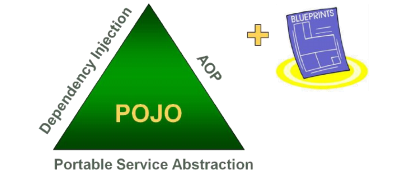
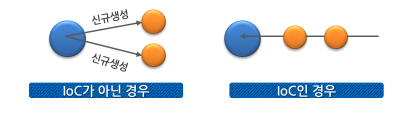

# 20.09.07

### 프레임워크

- 비기능적 요구사항(성능, 보안, 확장성, 안정성 등)을 만족하는 구조
- 안정적으로 실행하도록 제어해주는 잘 만들어진 구조의 라이브러리 덩어리

- 사용하는 이유
  - 비기능적 요소들을 초기 단계마다 구현해야하는 불합리함 극복
  - 기능적인 요구사항에 집중할 수 있도록 해준다
  - 반복적으로 발견되는 문제를 해결하기 위한 특화된 솔루션 제공

- 구성요소와 종류
  - IoC(Inversion of Control)
    - 제어의 역전
    - 인스턴스의 생명주기 관리를 개발자가 아닌 컨테이너가 대신 해준다.
    - 프레임워크의 동작원리를 제어흐름이 일반 프로그램 흐름과 반대로 동작
    - Spring 컨테이너는 IoC를 지원하며 메타데이터(XML)을 통해 beans를 관리하고 주요부분을 형성
    - bean들을 의존성 주입(Dependency Injection)을 통해 IoC를 지원
  - 클래스 라이브러리
    - 특정부분의 기술적인 구현을 라이브러리 형태로 제공(Semi Complete)
    - 라이브러리와 프레임워크의 차이점
      - 실행제어가 어디서 일어나는가
      - 라이브러리는 개발자가 만든 클래스에서 직접 호출하여 사용하므로 제어를 개발자의 코드가 관장
      - 프레임워크는 프레임워크에서 개발자가 만든 클래스를 호출하여 실행의 흐름에 대한 제어를 담당한다.
  - 디자인 패턴
    - 디자인 패턴 + 라이브러리 = 프레임워크
      - 디자인 패턴과 그것이 적용된 기반 라이브러리의 결합

### 프레임워크와 디자인 패턴의 관련성

#### 디자인 패턴

- 프레임워크의 핵심적 특징
- 애플리케이션을 설계할때 필요한 구조적 가이드라인이 되어줄 수 있지만
- 구현된 기반코드를 제공하지는 않는다.

#### 프레임워크

- 디자인패턴과 함께 패턴이 적용된 기반 클래스 라이브러리를 제공해서
- 프레임워크를 사용하는 구조적인 틀과 구현코드를 함께 제공


### Spring Framework

- Java 엔터프라이즈 개발을 편하게 해주는 오픈소스 **경량급 애플리케이션 프레임워크**
  - 애플리케이션프레임 워크
    - 애플리케이션의 전 영역을 포괄하는 범용적인 프레임워크
  - 경량급 프레임워크
    - 단순 웹컨테이너에서도 엔터프라이즈 개발의 고급기술을 대부분 사용 가능


- Spring 삼각형

  - 엔터프라이즈 개발의 복잡함을 상대하는 Spring의 전략

    - Portable Service Abstraction, DI, AOP, POJO

    

  - Portable Service Abstraction(추상화)
    
    - 기술적인 복잡함은 추상화를 통해 Low Level의 기술 구현 부분과 기술을 사용하는 인터페이스로 분리
  - 객체지향과 DI(Dependency Injection)
    - 객체지향에 충실한 설계가 가능하도록 단순한 객체 형태로 개발 가능
    - DI는 유연하게 확장가능한 객체를 만들어 두고 그 관계는 외부에서 다이나믹하게 설정
  - AOP(Aspect Oriented Programming)
    
    - 애플리케이션 로직을 담당하는 코드에 남아 있는 기술 관련 코드를 분리해서 별도의 모듈로 관리하게 해주는 강력한 기술
  - POJO(Plain Old Java Object)
    
    - 객체지향 원리에 충실하면서 특정 환경이나 규약에 종속되지 않고 필요에 따라 재활용될 수 있는 방식으로 설계된 객체


- 특징
  - 컨테이너 역할
    - 객체의 LifeCycle을 관리
    - Spring 컨테이너로부터 필요한 객체를 가져와 사용할 수 있다.
  - DI(Dependency Injection) 지원
    - 설정파일이나 어노테이션을 통해 객체 간의 의존관계를 설정할 수 있다.
  - AOP 지원
    - 트랜잭션이나 로깅, 보안과 같이 공통적 모듈을 핵심 모듈에서 분리해서 적용할 수 있다.
  - POJO 지원
    - Spring 컨테이너에 저장되는 Java 객체는 특정한 인터페이스를 구현하거나 특정 클래스를 상속받지 않아도 된다
  - 트랜잭션 처리를 위한 일관된 방법을 지원
    - 어떤 트랜잭션을 사용하던 설정을 통해 정보를 관리하여 트랜잭션에 상관없이 동일한 코드 사용가능
  - 영속성(Persistence)과 관련된 다양한 API 지원
    - DB처리를 위한 ORM(Object Relational Mapping) 프레임워크들과의 연동 지원


- Spring 프레임워크를 구성하는 기능 요소
  - Core 컨테이너
    - Spring 프레임워크의 기본 기능 제공
    - 이 모듈에 있는 BeanFactory는 Spring의 기본 컨테이너이며 DI의 기반이다.
  - Context
    - BeanFactory의 개념을 확장한 것
    - 국제화 메시지, 애플리케이션 생명주기 이벤트, 유효성 검증 지원
  - DAO
    - JDBC에 대한 추상화 계층
    - JDBC 코딩이나 예외처리 부분을 간편화
    - AOP 모듈을 이용해 트랜잭션 관리 서비스도 제공
  - ORM
    - MyBatis같은 ORM 프레임워크와의 연결고리 제공
  - AOP
    - Aspect 지향 프로그래밍 지원
  - Web
    - 웹애플리케이션 개발에 필요한 기본 기능 제공
  - WebMVC
    - MVC(Model/View/Controller) 패러다임을 바탕으로 웹 계층에서 결합도를 낮춘다
    - MVC는 사용자가 애플리케이션 로직과 분리되는 웹 애플리케이션을 만드는 경우에 일반적으로 사용되는 패러다임이다.

### IOC

- 제어의 역전이란 객체의 생성, 생명주기의 관리까지 모든 객체에 대한 제어권이 바뀌는 것을 의미



- IOC 컨테이너
  - 객체의 생성을 책임지고 의존성을 관리한다
  - POJO의 생성, 초기화, 서비스, 소멸에 대한 권한을 가진다


### DI

- 각 클래스간의 의존관계를 Bean 설정 정보를 바탕으로 컨테이너가 자동으로 연결해주는 것을 말함

- 개발자들은 단지 빈 설정파일에서 의존관계가 필요하다는 정보를 추가하면 된다.

- 객체 레퍼런스를 컨테이너로부터 주입받아서 실행시에 동적으로 의존관계 생성

- 장점

  - 코드가 단순해진다
  - 컴포넌트 간의 결합도가 제거된다

- 용어

  - 빈(Bean)
    - 스프링이 IoC방식으로 관리하는 객체라는 뜻
    - 스프링이 직접 생성과 제어를 담당하는 객체
  - Bean Factory
    - 스프링의 IoC를 담당하는 핵심 컨테이너
    - Bean을 등록, 생성, 조회, 반환하는 기능 담당
  - 애플리케이션 컨텍스트
    - Bean Factory를 확장한 IoC 컨테이너
    - Bean Factory와 동일하지만 스프링이 제공하는 부가서비스를 추가로 제공
  - 설정 메타정보(Configuration metadata)
    - BeanFactory가 IoC를 적용하기 위해 사용하는 메타정보
    - Bean 객체를 설정하고 구성할 때 사용된다.

- 유형

  - Setter Injection

    - Setter 메서드를 이용한 의존성 삽입
    - <property> 태그
    - ref속성은 사용하면 Bean의 id를 이요해 주입할 Bean을 찾는다
    - value 속성은 단순 값이거나 Bean이 아닌 객체를 주입할 때 사용

    ```xml
    <bean id="hello" class="myspring.di.xml.Hello">
        <property name="name" value="Spring"/>
        <property name="printer" ref="printer"/>
    </bean>
    ```

    

  - Constructor Injection

    - 생성자를 이용한 의존성 삽입
    - <constructor-arg> 태그
    - 생성자의 파라미터를 이용하기 때문에 한번에 여러 개의 객체를 주입할 수 있다.

    ```Xml
    <bean id="hello" class="myspring.di.xml.Hello">
    	<constructor-arg index="0" value="Spring"/>
        <constructor-arg index="1" ref="printer"/>
    </bean>
    ```

    

  - Method Injection

    - 일반 메서드를 이용한 의존성 삽입

  

### Junit

- Java에서 독립된 단위 테스트를 지원해주는 프레임워크


### Spring-Test

- `@RunWith`, `@ContextConfiguration` 등의 어노테이션을 활용하여 Spring Framework에서 조금 더 편하게 테스트를 지원할 수 있게 해준다.
- 환경 설정 url : https://devjjo.tistory.com/29
- 사용법 url : https://codevang.tistory.com/259


## 각 어노테이션의 역할

### @Configuration

- 특정 Java 클래스가 Spring의 환경 설정이라는 것으로 인식시키기 위해서 `@Configuration` 어노테이션을 사용해야 한다. 

```Java
@Configuration
public class Test{
    ...
}
```

> 클래스의 상단에 `@Configuration` 어노테이션을 사용함으로써 이 Java 클래스는 Spring의 환경 설정과 관련된 파일이라고 알려준다. 


### @Component와 @Bean의 차이

> ```@Component``` 어노테이션과 ```@Bean``` 어노테이션 둘다 ```Sprint(IOC) Container``` 에 Bean을 등록하도록 하는 메타데이터를 기입하는 어노테이션이다. 그러나 둘의 용도가 다르다.

### @Component

- 개발자가 직접 작성한 Class를 Bean으로 등록하기 위한 어노테이션이다.

```Java
@Component
public class Student{
    public Student(){
        System.out.println("hi");
    }
}
```

> `Student` Class는 개발자가 사용하기 위해서 직접 작성한 Class이다. 이러한 클래스를 Bean으로 등록하기 위해서는 상단에 `@Component` 어노테이션을 사용한 것을 볼 수 있다. Class의 이름을 Camelcase로 변경한 것이 Bean id로 사용된다.

### @Bean

- 개발자가 직접 제어 불가능한 외부 라이브러리 등을 ```Bean```으로 만들려할 때 사용된다.

```Java
@Configuration
public class ApplicationConfig{
    @Bean
    public ArrayList<String> array(){
        return new ArrayList<String>();
    }
}
```

> ```@Bean``` 어노테이션을 이용하여 Bean을 생성한 예제이다.
>
> ```ArrayList```같은 라이브러리 등을 Bean으로 등록하기 위해서는 별도로 해당 라이브러리 **객체를 반환하는 Method**를 만들고 `@Bean` 어노테이션을 적어주면 된다. 이 경우 Bean id는 Method 이름을 CamelCase로 변경한 것인 arrayList가 된다.


### @Autowired

- 의존관계를 자동설정할 때 사용하며 **타입**을 이용하여 의존하는 객체를 삽입해준다.
- 생성자나 setter 메소드 없이 의존성을 주입해서 자동으로 객체를 생성해주는 어노테이션

```Java
@Component
public class Pencil{
    ...
}

@component
public class Student{
    @Autowired
    private Pencil pencil;
    
    public Student(){
        System.out.println("hi");
    }
}
```

> `@Component` 를 사용한 Bean의 의존성 주입은 `@Autowired` 어노테이션을 이용하여 할 수 있다. 위 예제에서 Student가 Pencil에 대한 의존성을 가지고 있는 경우 `@Autowired` 어노테이션을 이용하여 의존성을 자동으로 주입할 수 있다.


### @Resource

- `@Autowired`와 흡사하지만 `@Autowired`는 by type이고 `@Resource`는 by name으로 연결한다는 점이 다르다.
