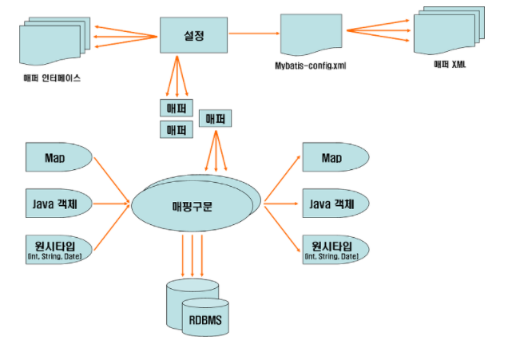

# 20.09.08

#### Framework와 Library의 차이점

- 제어 흐름의 주도권을 누가 가지고 있느냐의 차이

- 라이브러리 : 개발자
- 프레임워크 : 프레임워크
  - 라이브러리적인 요소도 가지고 있음
  - 개발자가 작성한 클래스를 역호출 하는 구조를 가
  - 역호출 하는 이유
    - infrastructural support, plumbing, 기반구조
    - byte code injection
- IoC(Inversion of Control) 제어의 역전
  - DI(Dependency Injection) : 의존선 주입
  - DL(Dependency Lookup) : 의존성 찾기


### DI

- Setter Injection
  - Setter Method의 아규먼트로 의존하는 객체의 레퍼런스를 주입받는 방식
- Constructor Injection
  - Constructor의 아규먼트로 의존하는 객체의 레퍼런스를 주입받는 방식
- Metod Injection
  - 일반 메서드의 아큐먼트로 의존하는 객체의 레퍼런스를 주입받는 방식


### Spring Bean Container 역할

- DI 컨테이너 = IoC컨테이너 = Spring Bean Container

- BeanFactory, ApplicationContext, GenericXmlApplicationContext
- getBean(name), getBean(name, ClassType)


### Configuration MetaData

- config/spring_beans.xml

```Xml
<beans>
	<bean id="strPrinter" class="myspring.di.xml.StringPrinter"/>
    <bean id="conPrinter" class="myspring.di.xml.ConsolePrinter"/>
    
    <!-- scope : singleton, prototype, request, session -->
    <bean id="hello" class="myspring.di.xml.Hello" scope="singleton">
    	<!-- setName(new String("스프링")) -->
        <property name="name" value="스프링"/>
        <!-- setPrinter(Printer printer), Printer p = new ConsolePrinter();
        <!-- setPrinter(new ConsolePrinter()) -->
        <property name="printer" ref="conPrinter"/>
    </bean>
</beans>
```


### Junit

- 단위(unit) 테스트를 지원하는 Java기반 테스팅 프레임워크
- 단위테스트 케이스 안에 테스트 메서드 선언 할 때 규칙
  - @Test 어노테이션 선언, public void 선언
- @Test, @Before, @After
- Assert.assertSame() : 주소비교, Assert.assertEquals() : 값 비교


### Spring-Test

- @RunWith(SpringJUnit4ClassRunner.clss)
  - jUnit 프레임워크의 테스트 실행방법을 확장할 때 사용하는 어노테이션
  - SpringJUnit4ClassRunner : jUnit이 테스트를 진행하는 중에 ApplicationContext를 만들고 관리하는 작업을 진행해준다.
- @ContextConfiguration
  - 스프링 빈(Bean) 설정 파일의 위치를 지정할때 사용되는 어노테이션
- @Autowired
  - 해당 변수에 자동으로 빈(Bean)을 매핑 해준다.
  - 변수, 메서드, 생성자 위에 붙일 수 있다.
  - getBean()의 역할


### Constructor Injection \<constructor-arg> 태그

```xml
<bean id="hello" class="myspring.di.xml.Hello">
	<constructor-arg index="0" value="Spring"/>
    <constructor-arg index="1" ref="printer"/>
</bean>

<bean id="hello" class="myspring.di.xml.Hello">
	<constructor-arg name="name" value="Spring"/>
    <constructor-arg name="printer" ref="printer"/>
</bean>
```


### Bean 등록 메타정보 구성 전략

1. XML 설정 단독 사용

   - 모든 Bean을 명시적으로 XML에 등록하는 방법
   - Bean의 개수가 많아지면 XML 파일을 관리하기 번거롭다
   - 여러 개발자가 같은 설정파일을 공유하여 개발하다보면 충돌이 일어나는 경우가 많다.

   

2.  어노테이션과 XML 설정 혼용해서 사용 (ver 2.5)

   - 특별한 어노테이션을 부여해주면 자동으로 찾아서 Bean으로 등록한다
   - `@Component` 어노텡션이 선언된 클래스를 자동으로 찾아서 Bean으로 등록해주는 방식
     - 빈 스캐닝(Bean Scanning)을 통한 자동인식 Bean 등록 기능
   - XML 문서 생성과 관리에 따른 수고를 덜어주고 개발속도 향상 가능

   ```java
   // <bean id="stringPrinter"/>
   @Component("stringPrinter")
   public class StringPrinter implements Printer{
       ...
   }
   ```

   ```xml
   <!-- 어노테이션이 선언된 클래스들을 스캔하기 위한 설정 -->
   <context:component-scan base-package="myspring.di.annot"/>
   ```

   

3. 어노테이션 설정 단독 사용(ver 3.0)

   - Spring JavaConfig 프로젝트는 XML이 아닌 자바코드를 이용해서 컨테이너를 설정할 수 있는 기능을 제공하는 프로젝트
   - `@Configuration`, `@Bean` 을 이용해서 스프링 컨테이너에 새로운 빈 객체를 제공할 수 있다
   - XML을 전혀 사용하지 않는다.

```Java
@Configuration
@ComponentScan(basePackages = { "myspring.di.annot" })
public class HelloConfig {
    ...
}
```


### Bean 등록 Annotation

- `@Component` : 컴포넌트를 나타내는 일반적인 스테레오 타입
  - `<bean>` 태그와 동일한 역할을 함
- `@Repository` : persistence 레이어, 영속성을 가지는 속성(DB)을 가진 클래스 - DAO
- `@Service` : 서비스 레이어, 비즈니스 로직을 가진 클래스
- `@Controller` : 프레젠테이션 레이어, 웹 어플리케이션에서 웹 요청과 응답을 처리하는 클래스

> `@Repository`, `@Service`, `@Controller`는 더 특정한 유즈케이스에 대한 `@Component`의 구체화된 형태


### Bean 의존관계 주입 Annotation

- `@Autowired`

  - 변수, setter 메서드, 생성자, 일반메서드에 적용 가능하다
  - 의존하는 객체를 주입할 때 주로 **Type**을 이용하게 된다.
  - `@Autowired`는\<property>, \<constructor-arg> 태그와 동일한 역할을 한다.

- `@Resource`

  - 변수와 setter 메서드에 적용 가능하다
  - 의존하는 객체를 주입할 때 주로 **Name**을 이용하게 된다

- `@Value`

  - 단순한 값을 주입할 때 사용

- `@Qualifier`

  - `@Autowired` 어노테이션과 같이 사용
  - `@Autowired`는 타입으로 찾아서 주입하므로 동일한 타입의 Bean 객체가 있을때 `@Qualifier`를 같이 사용

- Component Scan을 지원하는 태그

  - `<context:component-scan `태그

    - `@Component`를 통해 자동으로 Bean을 등록

    ```Xml
    <context:component-scan base-package="myspring.di.annot"/>
    ```

    


### Spring-Test에서 테스트를 지원하는 Annotation

- `@ContextConfiguratoin`
  - `@ContextConfiguration(classes=HelloConfig.class, loader=AnnotationConfigContextLoader.class)`
  - xml 설정을 안하고 Config 클래스를 이용할때 사용하는 Annotaion


### Bean 등록과 설정 Annotation

- `@Bean` 
  - `@Bean` 어노테이션은 새로운 빈 객체를 제공할 때 사용
  - `@Bean` 이 적용된 메서드의 이름을 Bean의 식별값으로 사용
  - `@Bean` `@Component` 의 차이
    - `@Component`는 클래스 위에 선언
    - `@Bean`은 메서드 위에 선언


# MyBatis란?

- 자바의 관계형 데이테베이스 프로그래밍을 조금 더 쉽게 할 수 있게 도와주는 개발 프레임 워크

- 개발자가 작성한 SQL 명령어와 자바 객체를 매핑해주는 기능 제공

- 특징

  - 복잡한 쿼리나 다이나믹한 쿼리에 강하다.(비슷한 쿼리는 남발되는 단점..)
  - 프로그램 코드와 SQL 쿼리의 분리로 코드의 간결성 및 유지보수성 향상
  - 빠른 개발이 가능하여 생산성이 향상된다.

  

### MyBatis 

- SqlSessionFactory

  - SQLSession을 생성하는 구성 요소

  

- SqlSession

  - SQL 실행 및 트랜잭션 제어를 위한 API를 제공하는 구성 요소
  - 데이터베이스에 엑세스할때 가장 중요한 역할을 한다.


### MyBatis-Spring

- SqlSessionFactoryBean

  - SqlSessionFactory를 작성하고 Spring DI 컨테이너에 개체를 저장하는 구성 요소
  - MyBatis에서는 SqlSessionFactory는 MyBatis 구성파일에 정의된 정보를 기반으로 하지만 SqlSessionFactoryBean은 구성파일이 없어도 빌드 할 수 있다.

  

- SqlSessionTempalte

  - SqlSession 인터페이스를 구현하는 Singleton 버전의 SqlSession 구성요소.
  - 핵심적인 역할을 하는 클래스로 SQL 실행이나 트랜잭션 관리를 한다.


### MyBatis 구조



- mybatis-config 는 mybatis의 메인 환경설정 파일이다.
- MyBatis는 매퍼 xml에 있는 각 SQL 명령어들을 Map에 담아서 저장하고 관리한다.