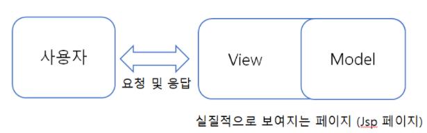

# 20.09.09

### MyBatis

- SQL을 별도의 파일로 분리해서 관리하게 해준다.
- 객체 - SQL 사이의 파라미터 Mapping 작업을 자동으로 해준다.
- VO 객체를 중심으로 개발이 편하다.
- 특징
  - 쉬운 접근성과 코드의 간결함
  - SQL문과 프로그래밍 코드의 분리
  - 다양한 프로그래밍 언어로 구현 가능
- sqlMapConfig.xml : MyBatis 설정파일(Data Source 설정)

- SqlSession : **Sql문 실행** - 가장 중요
- SqlSessionFactory : sqlSession 생성


### Servlet

-  웹 기반의 요청에 대한 동적인 처리가 가능한 Server Side에서 돌아가는 Java Program
- Java 코드 안에 HTML 코드(하나의 클래스)
- 웹 개발을 위해 만든 표준

### JSP

- Java언어를 기반으로 하는 Server Side 스크립트 언어
- HTML 코드안에 Java 코드
- Servlet을 보완하고 기술을 확장한 스크립트 방식 표준
  - Servlet의 모든 기능 + **추가적인 기능**
    - implicit objects
    - predefined tags
    - expression language
    - custom tags


### Servlet과 JSP의 차이

### Servlet

- data processiong(Controller)에 좋다
- DB와의 통신, Business Logic 호출, 데이터를 읽고 확인하는 작업에 유용
- Servlet이 수정된 경우 전체 코드를 업데이트하고 다시 컴파일한 후 재배포하는 작업 필요(개발 생산성 저하)

### JSP

- presentation(View)에 좋다
- 요청 결과를 나타내는 HTML 작성하는데 유용
- JSP가 수정된 경우 재배포할 필요 없이 WAS가 알아서 처리(쉬운 배포)


### MVC 패턴

- Model, View, Controller의 합성어

  - Model : 백그라운드에서 동작하는 로직을 처리
  - View : 사용자가 보게 될 결과 화면을 출력
  - Controller : 사용자의 입력처리와 흐름 제어를 담당

- Model1방식

  

  - 사용자의 요청을 JSP가 전부 처리
  - 사용자의 요청을 받은 JSP는 자바빈이나 서비스 클래스를 사용하여 작업을 처리하고 출력해준다.

- Model2방식

  

  - 웹브라우저 사용자의 요청을 서블릿이 받는다.
  - 서블릿은 웹 브라우저의 요청을 View로 보여줄 것인지 Model로 보내줄 것인지 정하여 전송
  - View페이지는 사용자에게 보여주는 역할만 담당
  - 실질적인 기능 부분은 Model에서 담당
  - 모델1방식에 비해 개발을 확장시키기도 쉽고 유지보수하기도 쉽다.


### JSP Tag

- 지시자 : JSP 페이지 처리에 필요한 정보느 다른 JSP 파일을 include할때 사용
  - `<%@page%> `: 해당 페이지의 전체적인 속성 지정, 언어 지정 및 import문
  - `<%@include%>` : 별도의 페이지를 현재 페이지에 삽입
  - `<%@taglib%>` : 태그 라이브러리의 태그 사용(...JSTL 등..)
    - 태그라이브러리 : 사용자가 만든 tag
    - url : 태그 라이브러리 위치 값
    - prefix : 태그를 가르키는 이름 값
- 선언
  - `<%! String str = "Subin" %>` : 전역으로 사용 가능, 메소드 선언 역시 가능
- 표현식 
  - `<%= str %>` : 결과값을 출력, String타입으로 브루아저에 표현
- 스크립트릿
  - `<% java소스 %>` : 자바코드를 넣고 가장 많이 사용

- 액션태그 : JSP 페이지 내에서 어떤 동작을 하도록 지시하는 태그

  - forward : 현재 페이지에서 다른 특정페이지로 전환(**url은 변경되지 않음**)

    ```jsp
    <jsp:forward page="nextPage.jsp"/>
    ```

  - include : 현재 페이지에 다른 페이지를 삽입할 때 사용

    ```jsp
    <h1>main.jsp 페이지</h1>
    <jsp:include page="sub.jsp" flush="true"/>
    <h1>다시 main.jsp 페이지</h1>
    ```

  - param

    ```jsp
    <jsp:forwad page="보내는">
    	<jsp:param value="" name=""/>
    </jsp:forwad>
    ```

    - `request.getParameter("name")`으로 받는다


### JSTL

- JSP 개발을 단순화하기 위한 태그 라이브러리
- 장점
  - 빠른 개발 - JSP를 단순화하는 많은 태그 제공
  - 코드 재사용성 - 다양한 페이지에서 JSTL 태그 사용 가능
  - 스크립틀릿 태그를 사용할 피룡가 없다.