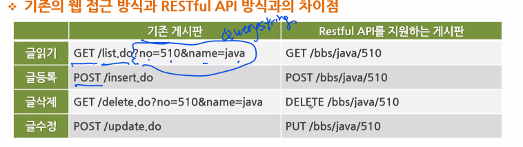
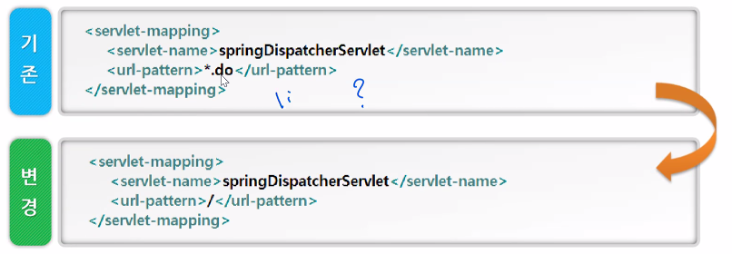
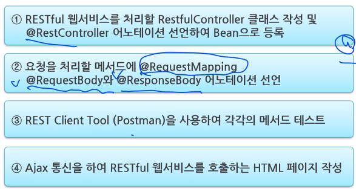

# 20.09.14

### @ModelAttribute

- HTTP 요청에 포함된 파라미터를 모델 객체로 바인딩
- formData -> UserVO 객체에 저장을 해서 넘겨준다.

### 한글처리

- `request.setCharacterEncoding("EUC-KR")`
  - client -> server 요청
  - spring이 EncodingFilter 클래스 제공
    - web.xml에 설정 필요(servlet과 관련)
- `response.setContentType("text/html;charset=EUC-KR")`
  - server -> client 응답
  - `<%@ page language="java" contentType="text/html; charset=EUC-KR"
        pageEncoding="EUC-KR"%>` 필요

### REST(REpresentational State Transfer)

- HTTP URI + HTTP Method
- HTTP URI를 통해 제어할 자원(Resource)을 명시
- HTTP Method(GET, POST, PUT, DELETE)를 통해 해당 자원을 제어하는 명령을 내리는 방식의 아키텍처
  - POST : Create(Insert)
  - GET : Read(Select)
  - PUT : Update of Create
  - DELETE : Delete

### RESTful API

- HTTP와 URI 기반으로 자원에 접근할 수 있도록 제공하는 애플리케이션 개발 인터페이스

- 기존 게시판은 GET과 POST만으로 자원에 대한 CRUD를 처리, URI는 액션을 나타낸다
- RESTful 게시판은 4가지 메서드를 모두 사용하여 CRUD를 처리, URI는 제어하려는 자원을 나타냄

### JSON(JavaScript Object Notation)

- JSON은 경량의 DATA-교환 방식

- Jackson : JSON 라이브러리
  - JSON형태를 Java 객체로
  - Java객체를 JSON 형태로 변환해주는 라이브러리

### Spring MVC 설정

- `@PathVariable` 사용을 위한 DispatcherServlet의 url-pattern 변경

  - 데이터를 보내주는 형식이 바뀌기 때문(RESTful 형식)

    -  `<mbv:default-servlet-handler/>` 필요

    - tomcat의 url패턴 충돌문제를 해결하기 위해서

- Spring MVC에 필요한 Bean들을 자동으로 등록해주는 태그
  - `<mvc:annotation-driven/>`
  - annotation-driven 태그가 JSON과 관련하여 내부적으로 처리하는 설정

### Spring MVC 기반 RESTful 웹서비스 구현 절차

### RESTful Controller를 위한 핵심 어노테이션

- `@RequestBody` : HTTP Request Body를 Java 객체로 전달받을 수 있다.
  - 없는 경우 : ViewResolver에 선택된 /user.jsp가 포워드 되고, user.jsp에서 UserModel 객체 참조
  - 있는 경우 : MappingJacksonHttpMessageConverter가 리턴값인 UserModel 객체를 JSON으로 변환하는 작업 처리
- `@ResponseBody` : Java객체를 HTTP ResponseBody로 전송할 수 있다.