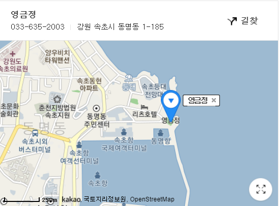

# 📌 속초 여행

## 🧾 스케쥴

### Day1

- 흥부네 밥상(점심)
  - 곤드레돌솥밥(15,000 x 3) = 45,000
- 낙산사(관광)
  - 요금 : 4천원
  - 주차장 유료
- 바다뷰제빵소(카페)
  - 약 30,000
- 숙소 체크인
- 흑돼지삼백식당(저녁)
  - 1인분 13,000 
  - 약 50,000
- 속초 중앙시장(야식)
  - 만석닭강정
    - 18,000원
  - 등등.. 약 30,000원


### Day2

- 청평호수공원(관광)
- 우송닭갈비(점심)
  - 순살 닭갈비 11,000원
  - 약 40,000원
- 집으로


#### 🚘 이동수단 : 자가용(혁진)

#### 💰 예상 비용(total)

- 숙소(에어비앤비) : 15만원

- 기름값 : 10만원
- 식비(넉넉잡아) : 25만원


#### 💰 실사용 금액

```
2021 속초여행
에어비앤비 144,345 원
휴게소 6,000 + 17,300 원
흥부네밥상 45,000원
낙산사 16,000원
바다뷰제빵소 43,100원
삼백식당(고기) 45,000원
만석닭강정 18,000원
현태네튀김 15,000원
주차비 200원(중앙시장)
맥주 10,000원
우송닭갈비 42,000원
토레타 3,600원
휴게소 6,800원
기름값 100,000원
—————————————————————
총 512,345 원
인당 170,800원
```


## 가볼만한 곳

### 1. 영금정


#### 위치




### 2. 권금성

- 케이블카로 10분 거리, 케이블카 탑승장은 설악동 소공원
- 이용시간 : 오전9시 ~ 오후 5시 30분
- 요금 : 왕복 10,000원


#### 위치


### 3. 낙산사

- 속초시내에서 남쪽으로 10km 위치에 있는 불교사찰
- 입장료: 4,000원
- 바로 옆에 홍련암과 의상대가 있어서 같이 보면 좋다.


#### 위치


### 4. 속초관광 수산시장(속초중앙시장)

- 만석닭강저 위치
- 닭강정, 새우튀김, 아바이 순대 등 다양한 먹거리
- 지하에는 회를 살 수 있는 곳(지하주차장 有)
- 오픈시간 : 오전10시 ~ 오후 10시


#### 위치


### 5. 설악 씨네라마

- 요금 : 4,500원


## 맛집

### 1. 소야동치미막국수


### 2. 속초왕왕숯불갈비


### 3. 궁중해장국


### 4. 우송닭갈비


### 5. 가조 오리촌

- 고성에 가까움


### 6. 단천면옥


### 7. 단천식당


### 8. 문어랑


