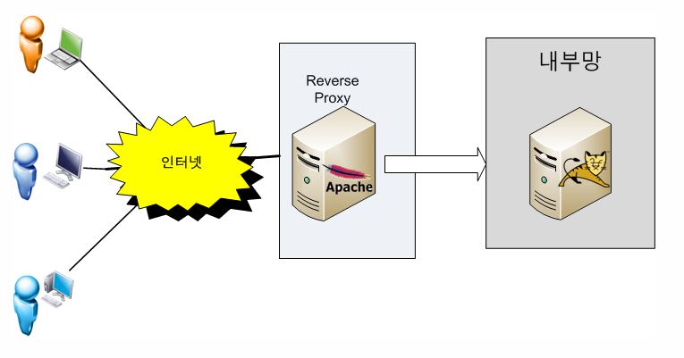

# Forward Proxy, Reverse Proxy

## Forward Proxy

  클라이언트가 `example.com`에 연결하려고 하면 사용자 PC가 직접 연결하는게 아니라 **Forward Proxy** 서버가 요청을 받아서 `exmple.com`에 연결하여 그 결과를 클라이언트에 전달(forward) 해준다.

  **Forward Proxy**는 대개 캐쉬 기능이 있으므로 자주 사용되는 컨텐츠라면 월등한 성능 향상을 가져올 수 있으며 정해진 사이트만 연결하게 설정하는 등 웹 사용 환경을 제한할 수 있으므로 기업 환경 등에서 많이 사용한다.

  

## Reverse Proxy

  클라이언트가 `example.com` 웹 서비스에 데이터를 요청하면 **Reverse Proxy**는 이 요청을 받아서 내부 서버에서 데이터를 받은 후에 이 데이터를 클라이언트에 전달하게 된다. 내부 서버가 직접 서비스를 제공해도 되지만 이렇게 구성하는 이유 중 하나는 보안때문이다.

  보통 기업의 네트워크 환경은 **DMZ**라고 하는 내부 네트워크와 외부 네트워크 사이에 위치하는 구간이 존재하며 이 구간에는 메일 서버, 웹 서버, FTP 서버 등 외부 서비스를 제공하는 서버가 위치하게 된다. 서비스를 자바로 구현해서 **WAS**를 **DMZ**에 놓고 서비스해도 되지만 **WAS**는 보통 DB서버와 연결되므로 **WAS**가 털릴 경우 DB 서버까지 같이 털리는 심각한 문제가 발생할 수 있다.

  이 때문에 **Reverse Proxy** 서버를 두고 실제 서비스 서버는 내부망에 위치시켜 Proxy 서버만 내부에 있는 서비스 서버와 통신해서 결과를 클라이언트에게 제공하는 방식으로 서비스를 하게 된다.

  특히, 리눅스 환경이라면 **Reverse Proxy**로 아파치 웹 서버를 사용하면 SELinux를 켜 놓으면 SELinux의 기본 정책이 웹서버는 톰캣의 8080, 8009 포트만 접근할 수 있으므로 아파치 웹 서버가 해킹당해도 웹 서버 권한으로는 내부망으로 연결이 **불가능하다.** 또한, **Reverse Proxy**를 cluster로 구성해 놓으면 가용성을 높일 수 있고 사용자가 증가하는 상황에 맞게 Web Server나 WAS를 유연하게 늘릴 수 있는 장점이 있다.

  