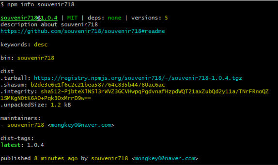
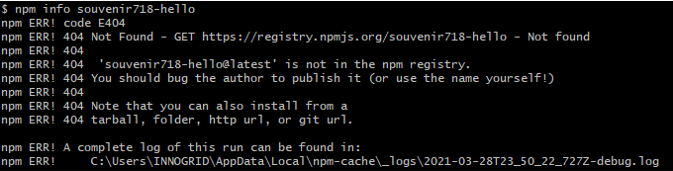
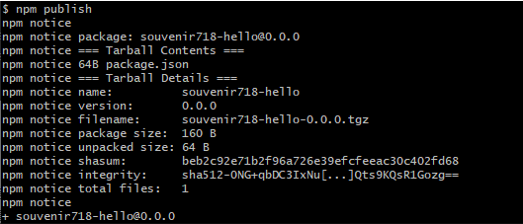
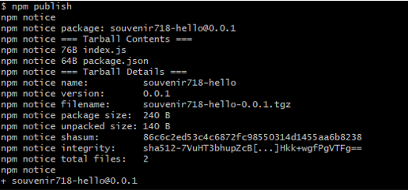

# 패키지 배포(npm publish)

> 필요조건 : [npm홈페이지](https://www.npmjs.com/) 회원가입 및 이메일 인증

## npm 로그인

npm계정을 이용하여 터미널에 `npm login` 커맨드를 입력하여 개인정보를 입력한다.

```bash
$ npm login
(...생략...) // 한번 로그인 이후에는 반복 x
Logged in as souvenir718 on https://registry.npmjs.org/.
```

로그인 확인을 위해 `npm whoami` 커맨드를 입력하면 자신의 **username**이 출력된다.

```bash
$ npm whoami
souvenir718
```


## 패키지명 결정

패키지명의 경우는 중복이 되지 않는지 npm 사이트에 검색을 해보거나 터미널에서 `npm info <package-name>`을 입력하여 확인이 가능하다.

### Ex.

**패키지명이 있는 경우**

  

**패키지명이 없는 경우**

 


## 패키지 생성

`souvenir718-hello`라는 이름을 가진 패키지를 생성해보자.

```bash
$ mkdir souvenir718-hello
$ cd souvenir718-hello
$ touch package.json
```

`package.json` 파일에는 해당 패키지에 대한 기본 정보를 입력하도록 되어있다. 패키지를 배포할 때 필수적으로 필요한 정보는 패키지명과 버전이다.  아래와 같이 `name`과 `version` 필드에 원하는 패키지명과 버전을 입력하면 된다.

**packge.json**

```json
{
    "name": "souvenir718-hello",
    "version": "0.0.0"
}
```


## 패키지 배포

터미널에 `npm publish`를 입력하면 패키지 배포가 진행된다.( ※ 로그인 확인 필수)

 

배포한 패키지는 `npm info` 커맨드 혹은 npm 사이트에서 확인할 수 있습니다.

> https://www.npmjs.com/package/souvenir718-hello


## 패키지 내용 갱신

패키지에 `index.js` 파일을 생성하고 콘솔 출력 함수를 추가해보자.

**index.js**

```javascript
module.exports = function() {
    console.log("Hello, souvenir718");
}
```


`README.md` 파일에 작성한 내용은 패키지 메인화면에 표시된다.

**README.md**

```markdown
# Hello souvenir718

print 'Hello, souvenir718' in the console.
```


## 패키지 재배포

갱신된 내용은 `npm`에 다시 배포를 해야 업데이트가 된다. 배포 전 `package.json`에 `version`을 올려줘야 한다. 이 경우에 직접 수정을 하거나 터미널에 `npm version patch` 커맨드를 사용하여 올린다.

```bash
$ npm version patch
v0.0.1
```

처음 패키지를 배포할때와 마찬가지로 터미널에서 `npm publish`를 입력해준다.

 


**🎈 [출처](https://www.daleseo.com/js-npm-publish/)**

