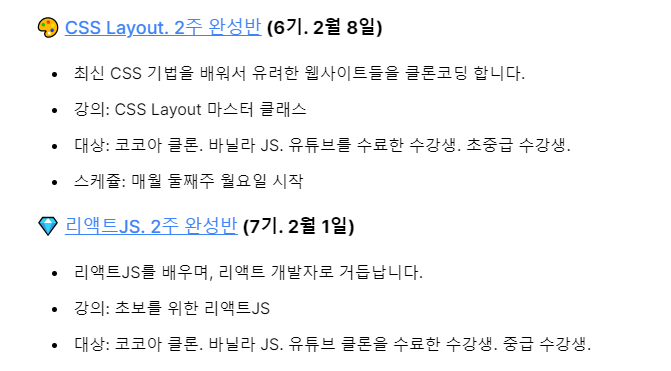

- Etc..

  - [배경화면 API](https://unsplash.com/developers)
- soumentum 리팩토링 관련 
- [롤 API](https://developer.riotgames.com/)
- [TIL](https://til-kaya.netlify.app/#/./docsify/docsify)
  
  - 블로그 형식으로 변환에 대해 생각해보기
  - [프로그래머스 2020 winter Coding - 겨울방학 스타트업 인턴 프로그램](https://programmers.co.kr/learn/challenges?tab=all_challenges)
- 키움증권
  - [노마드코더 리액트](https://hungry-noether-8ac1d6.netlify.app/#/)
  - SOUPEDIA 리팩토링 관련 
      - 상세페이지쪽 추천 or 비슷한 영화 추천 만들지 생각
- 노마드코더 첼린지
  - [투두리스트](https://nomadcoders.co/community/thread/182)
  -  
  
- 정리할거
  
  - React
    - router
    - swr - react query
    - withcredential
  - JS
    - stringify
    - 정규표현식
    - getter setter
    - for await of
  - CSS
    - transition
    - rotation
  - react native
    - navigation
  - React 
    - 웹 게임으로 배우는 리액트
      - 4-1 ~ 4-3

# 오늘 할 일 (21.02.07)

- 스페인어
  - 듀오링고
    - [ ] Phrases 복습
    - [ ] Family 복습
    - [ ] People 복습
    - [ ] 모르는 단어나 문장 정리해보기
- Sing
  - 꿈속에너 - 전상근
    - [ ] 레슨
    - [ ] 피드백 적기
- JS
  - [투두리스트( ~ 2.15)](https://nomadcoders.co/community/thread/182)
    - [ ] 기본 틀 구성
    - [ ] local storage 이용
    - [ ] 일별 todo
- Algorithm
  - 백준
    - [ ] [4344. 평균은 넘겠지](https://www.acmicpc.net/problem/4344)

- JandiFarm
  - [x] 11시 스크럼 미팅

# 오늘 할 일 (21.02.06)

- 스페인어
  - 듀오링고
    - [ ] Phrases 복습
    - [ ] Family 복습
    - [ ] People 복습
    - [ ] 모르는 단어나 문장 정리해보기
- Sing
  - 꿈속에너 - 전상근
    - [ ] 발음 연습
    - [ ] 울트라 브리드 연습
      - [x] 호흡
      - [x] 음정 내기
- JS
  - [투두리스트( ~ 2.15)](https://nomadcoders.co/community/thread/182)
    - [ ] 기본 틀 구성
- Algorithm
  - 백준
    - [ ] [4344. 평균은 넘겠지](https://www.acmicpc.net/problem/4344)

# 오늘 할 일 (21.02.05)

- 스페인어
  - 듀오링고
    - [x] Travel2 5/5
- Sing
  - 꿈속에너 - 전상근
    - [ ] 발음 연습
    - [x] 울트라 브리드 연습
      - [ ] 호흡
      - [ ] 음정 내기
- JS
  - [투두리스트( ~ 2.15)](https://nomadcoders.co/community/thread/182)
    - [x] 기본 틀 구성 진행중..
- React
  - [ ] router 정리
- Algorithm
  - 백준
    - [ ] [4344. 평균은 넘겠지](https://www.acmicpc.net/problem/4344)

# 오늘 할 일 (21.02.04)

- 스페인어
  - 듀오링고
    - [x] Travel 2 4/5
    - [x] Restaurant 복습
- Sing
  - 꿈속에너 - 전상근
    - [ ] 발음 연습
    - [x] 울트라 브리드 연습
      - [x] 호흡
      - [ ] 음정 내기
- JS
  - [투두리스트( ~ 2.15)](https://nomadcoders.co/community/thread/182)
    - [x] [참고사이트](https://medium.muz.li/todo-list-inspiration-a1d736c2718a) 생각해보기
      - [핀터레스트](https://www.pinterest.co.kr/pizwu/todo-list-inspiration/)
    - [x] 필요 기능 생각해보기
      - local storage 이용
      - 일별 todo
        - datepicker 이용
      - done, delete 기능 - 줄만 긋기.
      - done 목록 보기
      - 배경화면 API 사용
- React
  - SOUPEDIA
    - [x] 상세페이지 안 비슷한 작품 추가
  - [ ] router 정리
- Algorithm
  - 백준
    - [ ] [4344. 평균은 넘겠지](https://www.acmicpc.net/problem/4344)

# 오늘 할 일 (21.02.03)

- 스페인어
  - 듀오링고
    - [x] Travel 2 4/5
    - [x] School 복습
- Sing
  - 꿈속에너 - 전상근
    - [ ] 발음 연습
    - [x] 울트라 브리드 연습
      - [ ] 호흡
      - [ ] 음정 내기
- React
  - ReactJS로 영화 웹 서비스 만들기
    - [x] 헤더 ([왓챠피디아 보고 따라하기](https://pedia.watcha.com/ko-KR/contents/m5eQ6M5))
    - [x] gh-page 이용해서 배포
  - [ ] router 정리
- Algorithm
  - 백준
    - [ ] [4344. 평균은 넘겠지](https://www.acmicpc.net/problem/4344)
- Portfolio
  - [x] SOUPEDIA 정리

# 오늘 할 일 (21.02.02)

- 스페인어

  - 듀오링고
    - [x] Travel 2 3/5
    - [ ] School 복습

- Sing

  - 꿈속에너 - 전상근
    - [ ] 발음 연습
    - [x] 울트라 브리드 연습
      - [x] 호흡
      - [x] 음정 내기

- React

  - ReactJS로 영화 웹 서비스 만들기

    - [ ] 헤더 ([왓챠피디아 보고 따라하기](https://pedia.watcha.com/ko-KR/contents/m5eQ6M5))

    - [x] [Detail API](https://developers.themoviedb.org/3/movies/get-movie-details) 받아오는 거에 대해 생각해보고 구조 짜기
      - 비슷한 작품, 리뷰 쪽 생각해보기(추가할지?)

  - [ ] router 정리

- Algorithm

  - 백준
    - [ ] [4344. 평균은 넘겠지](https://www.acmicpc.net/problem/4344)

# 오늘 할 일 (21.02.01)

- 스페인어
  - 듀오링고
    - [x] Travel 2 2/5
- Sing
  - 꿈속에너 - 전상근
    - [ ] 발음 연습
    - [x] 울트라 브리드 연습
      - [x] 호흡
      - [ ] 음정 내기
- React
  - ReactJS로 영화 웹 서비스 만들기
    - 리팩토링
      - [x] Detail 페이지 ([왓챠피디아 보고 따라하기](https://pedia.watcha.com/ko-KR/contents/m5eQ6M5))
        - Detail API 받아오는 거에 대해 생각해보고 구조 짜기
        - 헤더부분 작성하기

- Algorithm
  - 백준
    - [ ] [4344. 평균은 넘겠지](https://www.acmicpc.net/problem/4344)

# 오늘 할 일 (21.01.31)

- 스페인어
  - 듀오링고
    - [x] Travel 2 1/5
- Sing
  - 꿈속에너 - 전상근
    - [ ] 레슨
    - [ ] 피드백 작성
- React
  - ReactJS로 영화 웹 서비스 만들기
    - 리팩토링
      - [ ] Detail 페이지 ([왓챠피디아 보고 따라하기](https://pedia.watcha.com/ko-KR/contents/m5eQ6M5))

- Algorithm
  - 백준
    - [ ] [4344. 평균은 넘겠지](https://www.acmicpc.net/problem/4344)
- JandiFarm
  - [x] 6주차 스크럼 미팅(11시)

# 오늘 할 일 (21.01.30)

- 스페인어
  - 듀오링고
    - [x] Travel 1 복습
- Sing
  - 꿈속에너 - 전상근
    - [ ] 발음 연습
    - [ ] 울트라 브리드 연습
      - [x] 호흡
      - [ ] 음정 내기
- React
  - ReactJS로 영화 웹 서비스 만들기
    - 리팩토링
      - [x] API 변경 ( 👉 TMDB )
      - [ ] Detail 페이지 ([왓챠피디아 보고 따라하기](https://pedia.watcha.com/ko-KR/contents/m5eQ6M5))

- Algorithm
  - 백준
    - [ ] [4344. 평균은 넘겠지](https://www.acmicpc.net/problem/4344)

# 오늘 할 일 (21.01.29)

- 스페인어
  - 듀오링고
    - [x] Shopping 복습
    - [ ] Travel 2 1/5
- Sing
  - 꿈속에너 - 전상근
    - [ ] 발음 연습
    - [ ] 울트라 브리드 연습
      - [x] 호흡
      - [ ] 음정 내기
- React
  - ReactJS로 영화 웹 서비스 만들기
    - [ ] 리팩토링
  - SuzyStar
    - [x] ghpage 배포
- Algorithm
  - 백준
    - [ ] [4344. 평균은 넘겠지](https://www.acmicpc.net/problem/4344)

- Portfolio
  - [x] [README 작성](https://github.com/souvenir718/souvenir718.github.io)

# 오늘 할 일 (21.01.28)

- 스페인어
  - 듀오링고
    - [x] Greetings 5/5
- Sing
  - 꿈속에너 - 전상근
    - [ ] 발음 연습
    - [ ] 울트라 브리드 연습
      - [ ] 호흡
      - [ ] 음정 내기
- React
  - ReactJS로 영화 웹 서비스 만들기
    - [x] #4 ~ #6

- Algorithm
  - 백준
    - [ ] [4344. 평균은 넘겠지](https://www.acmicpc.net/problem/4344)

# 오늘 할 일 (21.01.27)

- 스페인어
  - 듀오링고
    - [x] Greetings 4/5
- Sing
  - 꿈속에너 - 전상근
    - [ ] 발음 연습
    - [ ] 울트라 브리드 연습
      - [ ] 호흡
      - [ ] 음정 내기
- React
  - ReactJS로 영화 웹 서비스 만들기
    - [x] #0 ~ #3
- GraphQL
  - [x] GraphQL & REST 정리
- JS
  - [x] V8 엔진 정리
- Algorithm
  - 백준
    - [ ] [4344. 평균은 넘겠지](https://www.acmicpc.net/problem/4344)

# 오늘 할 일 (21.01.26)

- 스페인어
  - 듀오링고
    - [x] Greetings 3/5
- Sing
  - 꿈속에너 - 전상근
    - [ ] 발음 연습
    - [x] 울트라 브리드 연습
      - [x] 호흡
      - [ ] 음정 내기
- JS
  - 바닐라 JS로 크롬앱 만들기
    - 리팩토링 해보기.
      - [x] 삭제버튼 CSS 수정
      - [x] 아이콘 에러 수정
- GraphQL
  - GrapQL로 영화 API 만들기
    - [x] \# 8~14
    - [x] README 정리

- Algorithm
  - 백준
    - [ ] [4344. 평균은 넘겠지](https://www.acmicpc.net/problem/4344)

# 오늘 할 일 (21.01.25)

- 스페인어
  - 듀오링고
    - [ ] Greetings 3/5
- Sing
  - 이번주 레슨곡 찾아보기!
    - [x] 다이브에 알맞은 곡
    - [x] 레슨 받앗던 곡
- JS
  - 바닐라 JS로 크롬앱 만들기
    - [x] README 마무리.
- GraphQL
  - GrapQL로 영화 API 만들기
    - [x] \# 1~7
- Algorithm
  - 백준
    - [ ] [4344. 평균은 넘겠지](https://www.acmicpc.net/problem/4344)

# 오늘 할 일 (21.01.24)

- 스페인어
  - 듀오링고
    - ~~Greetings~~ 2/5
- Sing
  - 별짓 다해봤는데 - 더원
    - ~~레슨~~
    - ~~피드백 적기~~
- JS
  - 바닐라 JS로 크롬앱 만들기
    - 모멘텀 따라 만들기
      - ~~Todo~~
      - ~~Search~~
- Jandi
  - 5주차 스크럼 미팅
    - ~~11시~~
- 예비군
  - ~~온라인 듣기~~

# 오늘 할 일 (21.01.23)

- 스페인어
  - 듀오링고
    - ~~Greetings 1/5~~
- Sing
  - 별짓 다해봤는데 - 더원
    - 발음 연습
    - 울트라 브리드 연습
      - 호흡
      - 음정 내기
- JS
  - 바닐라 JS로 크롬앱 만들기
    - 모멘텀 따라 만들기
      - ~~위치 받아오기~~
      - ~~위치 값 이용해서 날씨 정보 받아오기~~
- daily101
  - README 정리
    - ~~기술 특장점(앱)~~
    - ~~시연 영상~~

# 오늘 할 일 (21.01.22)

- 스페인어
  - 듀오링고
    - Greetings 1/5
    - ~~Intro 복습~~
- Sing
  - 별짓 다해봤는데 - 더원
    - 발음 연습
    - 울트라 브리드 연습
      - 호흡
      - 음정 내기

- JS
  - 바닐라 JS로 크롬앱 만들기
    - 모멘텀 따라 만들기
      - ~~배경화면 기능~~
      - ~~상단 검색 기능~~

# 오늘 할 일(21.01.21)

- 스페인어
  - 듀오링고
    - ~~CheckPoint 1~~
- Sing
  - 별짓 다해봤는데 - 더원
    - 발음 연습
    - 울트라 브리드 연습
      - 호흡
      - 음정 내기
- JS

  - 바닐라 JS로 크롬앱 만들기
    - ~~코드 챌린지 8~~
      - 계산기 만들기~
- GraphQL - node
  - ~~Tutorial 완성~~

# 오늘 할 일 (21.01.20)

- 스페인어
  - 듀오링고
    - ~~People~~ 5/5
    - ~~Shopping~~ 복습
- Sing
  - 별짓 다해봤는데 - 더원
    - 발음 연습
    - 울트라 브리드 연습
      - 호흡
      - 음정 내기
- JS

  - 바닐라 JS로 크롬앱 만들기
    - ~~코드 챌린지 7~~
      - input range
- GraphQL - node
  - ~~Tutorial 1~3~~

# 오늘 할 일 (21.01.19)

- 스페인어

  - 듀오링고
    - ~~People 4/5~~
- Sing

  - 별짓 다해봤는데 - 더원
    - 발음 연습
    - 울트라 브리드 연습
      - 호흡
      - 음정 내기
- JS

  - - 바닐라 JS로 크롬앱 만들기
      - 복습

# 오늘 할 일 (21.01.18)

- 스페인어

  - 듀오링고
    - ~~People~~ 3/5
    - ~~Travel~~ 복습
- Sing

  - 별짓 다해봤는데 - 더원
    - 발음 적기
- JS

  - - 바닐라 JS로 크롬앱 만들기
      - #~~3.5~ 3.7~~
        - local Storage
    - ~~code challenge~~ 제출
  
- Souvies
  - ~~README.md~~ 정리

- paintJS
  - ~~README.md~~ 업데이트!

# 오늘 할 일 (21.01.17)

- 스페인어
  - 듀오링고
    - ~~People~~ 2/5
- Sing
  - 레슨
    - 가로수 그늘 아래 서면 - 임재범
      - **완벽해지려 하지 말자**.
      - 다이브 상태 유지하기.

# 오늘 할 일 (21.01.16)

- 스페인어
  - 듀오링고
    - ~~Family~~ 복습
    - ~~People~~ 1/5
- JS
  - 바닐라 JS로 크롬앱 만들기
    - #~~3.3 ~ 3.4~~
      - local Storage
    - ~~code challenge~~ 제출

- daily101
  - portfolio 만들기
    - ~~초안 작성~~

# 오늘 할 일 (21.01.15)

- 스페인어
  - 듀오링고
    - ~~Phrases~~ 복습
- JS
  - 바닐라 JS로 크롬앱 만들기
    - #~~3.1 ~ 3.2~~
    - ~~code challenge~~ 제출

# 오늘 할 일 (21.01.14)

- 스페인어
  - 듀오링고
    - ~~School 5/5~~
- JS
  - 바닐라 JS로 크롬앱 만들기
    - ~~#2.5 ~ 2.7~~
    - ~~code challenge 제출~~

# 오늘 할 일 (21.01.13)

- 스페인어
  - 듀오링고
    - ~~School 4/5~~
- JS
  - 바닐라 JS로 크롬앱 만들기
    - ~~#2.1 ~ 2.4~~
    - ~~code challenge 제출~~

# 오늘 할 일 (21.01.12)

- 스페인어
  - 듀오링고
    - ~~School 3/5~~

- JS
  - 바닐라 JS로 크롬앱 만들기
    - ~~#1.6 ~ 1.10~~

# 오늘 할 일 (21.01.11)

- 스페인어
  - 듀오링고
    - ~~Intro 복습~~
- JS
  - 바닐라 JS로 그림판 만들기
    - **완료!**
  - 바닐라 JS 2주 완성
    - 바닐라 JS로 크롬앱 만들기
      - ~~#1.1 ~ 1.5~~

# 오늘 할 일 (21.01.09)

- 스페인어
  - 듀오링고
    - ~~School 2/5~~
    - ~~Pharse 5/5 복습~~
- Sing
  - 가로수 그늘 아래 서면 - 임재범
    - ~~발음연습~~
    - ~~Ultrabreathe 연습~~
- JS
  - 바닐라 JS로 그림판 만들기
    - ~~setup styles~~

# 오늘 할 일 (21.01.08)

- 스페인어
  - 듀오링고
    - ~~School 1/5~~
- Sing
  - 가로수 그늘 아래 서면 - 임재범
    - 발음연습
    - Ultrabreathe 연습

# 오늘 할 일 (21.01.07)

- 스페인어
  - 듀오링고
    - ~~Pres Tense 2/2~~
- Sing
  - 가로수 그늘 아래 서면 - 임재범
    - ~~발음연습~~
    - ~~Ultrabreathe 연습~~

- ~~오픈데이터 정리~~

# 오늘 할 일 (21.01.06)

- 스페인어
  - 듀오링고
    - ~~Pres Tense 1/2~~
- Sing
  - 가로수 그늘 아래 서면 - 임재범
    - ~~발음연습~~
    - ~~Ultrabreathe 연습~~
- JS
  - 바닐라 JS로 그림판 만들기
    - ~~setup styles~~
- ~~포워드 프록시, 리버스 프록시 정리~~
- ~~API 게이트웨이 정리~~

# 오늘 할 일 (21.01.05)

- 스페인어
  - 듀오링고
    - ~~Shopping 5/5~~
- Sing
  - 가로수 그늘 아래 서면 - 임재범
    - 발음연습
    - Ultrabreathe 연습
- 토익

# 오늘 할 일 (21.01.04)

- 스페인어
  - 듀오링고
    - ~~Shopping 4/5~~
- Sing
  - 가로수 그늘 아래 서면 - 임재범
    - 발음연습
    - Ultrabreathe 연습
- Algorithm
  - 눈 떠보니 코딩테스트 전날
    - ~~재귀함수~~
- JS
  - Javascript 핵심 개념 알아보기 - JS Flow
- 토익

# 오늘 할 일 (21.01.03)

- 스페인어
  - 듀오링고
    - ~~Shopping 3/5~~
- Sing
  - 너도아는 - 폴킴
    - 발음연습
    - Ultrabreathe 연습
    - 레슨
      - Ultrabreathe로 음정 내는거 극복하자!
      - 음은 다 코로! 목으로 내는 습관 고치기!
- Algorithm
  - 눈떠보니 코딩테스트 전날
    - ~~문제 5: 그림자 연결~~
- JS
  - Javascript 핵심 개념 알아보기 - JS Flow
    - ~~Class~~

- 이번주 회고 및 다음주 계획 작성

# 오늘 할 일 (21.01.02)

- 스페인어
  - 듀오링고
    - ~~Shopping 2/5~~

- Sing
  - 너도아는 - 폴킴
    - ~~발음연습~~
    - ~~Ultrabreathe 연습~~
- Algorithm
  - 눈떠보니 코딩테스트 전날
    - 문제 5: 그림자 연결
- JS
  - Javascript 핵심 개념 알아보기 - JS Flow
    - ~~Prototype~~

# 오늘 할 일 (21.01.01)

- 스페인어
  - 듀오링고
    - ~~Shopping 1/5~~
- Sing
  - 너도아는 - 폴킴
    - ~~발음연습~~
    - ~~Ultrabreathe 연습~~
- Algorithm
  - 눈떠보니 코딩테스트 전날
    - 문제 5: 그림자 연결
- JS
  - Javascript 핵심 개념 알아보기 - JS Flow

# 오늘 할 일 (20.12.30)

- 스페인어
  - 듀오링고
    - ~~Intro 5/5~~
    - ~~Family 4/5~~
    - ~~Family 5/5~~
- Sing
  - 너도아는 - 폴킴
    - 발음연습
    - ~~Ultrabreathe 연습~~
- Algorithm
  - 눈떠보니 코딩테스트 전날
    - 문제 5: 그림자 연결
- JS
  - Javascript 핵심 개념 알아보기 - JS Flow
    - ~~Closure~~

# 오늘 할 일 (20.12.29)

- 스페인어
  - 듀오링고
    - ~~Phrases 5/5~~
    - ~~Restaurant 5/5~~
    - Family 4/5
  
- Sing
  - 너도아는 -  폴킴
    - ~~발음 연습~~
    - ~~Ultrabreathe 연습~~

- Algorithm
  - 눈떠보니 코딩테스트 전날
    - 문제 5: 그림자 연결
- JS
  - Javascript 핵심 개념 알아보기 - JS Flow
    - ~~콜백함수~~

# 오늘 할 일 (20.12.28)

- 스페인어
  - 듀오링고
    - ~~Restaurant 4/5~~
    - ~~Family 3/5~~
- Sing
  - 너도아는 -  폴킴
    - ~~발음 적기~~
    - ~~Ultrabreathe 연습~~
- Algorithm
  - 눈떠보니 코딩테스트 전날
  - ~~문제4 - 자리를 양보해가며!~~

- JS
  - Javascript 핵심 개념 알아보기 - JS Flow
    - ~~this~~
- MyData
  - ~~마이데이터 19년도 공모전 자료 정리~~
  - ~~주요 용어 정리~~
  - ~~마이데이터 서비스 안내서(한국데이터산업진흥원) 정리~~

# 오늘 할 일 (20.12.27)

- 스페인어
  - 듀오링고
    - ~~Restaurant 3/5~~
    - ~~Family 2/5~~
- Sing
  - 감기 - 이기찬
    - ~~레슨~~
    - ~~Ultrabreathe 연습~~
- Algorithm
  - 눈떠보니 코딩테스트 전날
    - ~~문제3 - 섬으로 건너가라~~
- JS
  - Javascript 핵심 개념 알아보기 - JS Flow
    - ~~실행 콘텍스트~~

# 오늘 할 일 (20.12.26)

- 스페인어
  - 듀오링고
    - ~~Restaurant 2/5~~
    - ~~Family 1/5~~
- Sing
  - 감기 - 이기찬
    - ~~발음 연습~~
- Algorithm
  - 눈떠보니 코딩테스트 전날
    - ~~문제2 - JAVA독과 함께~~

- JS
  - Javascript 핵심 개념 알아보기 - JS Flow
    - ~~데이터 타입~~

# 오늘 할 일 (20.12.25)

- 스페인어
  - 듀오링고
    - ~~Restaurant 1/5~~
- Sing
  - 감기 - 이기찬
    - 발음 적기
- Algorithm
  - 눈떠보니 코딩테스트 전날
    - ~~암호를 해독해라~~
- JS
  - ~~문자열을 수로 바꾸는 함수~~ 정리
  - ~~아스키코드 변환 함수~~ 정리

# 오늘 할 일 (20.12.24)

- 스페인어
  - 듀오링고
    - ~~Travel 4/5~~
    - ~~Travel 5/5~~
- JS
  - ~~URI & URL~~ 정리
  - ~~브라우저 동작 방법~~ 정리
- MyData
  - ~~마이데이터 실증사례~~ 정리
- 출근
  - 9일차

# 오늘 할 일 (20.12.23)

- 스페인어
  - 듀오링고
    - ~~Travel 2/5~~
    - ~~Travel 3/5~~
- MyData
  - 제도 관련 정리
- 출근 8일차

# 오늘 할 일 (20.12.22)

- 스페인어
  - 듀오링고
    - ~~Travel 1/5~~
- JS
  - ~~Babel~~ 정리
- My Data
  - ~~발표~~
- 출근 7일차

# 오늘 할 일 (20.12.21)

- 스페인어
  - 듀오링고
    - ~~Phrases 4/5~~
- My Data
  - ~~대본 작성~~
  - ~~내일 발표 준비~~
- Cloud
  - ~~kube-proxy~~ 수정
- 출근 6일차

# 오늘 할 일 (20.12.20)

- 스페인어
  - 듀오링고
    - ~~Phrases 3/5~~
- JS
  - ~~Array API~~ 정리
- React
  - ~~scheduler 기본 세팅~~
- Sing
  - 이기찬 - 미인
    - 레슨
      - 밀지 말기!
      - 뒤쪽에 놓고 발음 연습하기

# 오늘 할 일 (20.12.19)

- 스페인어
  - 듀오링고
    - ~~Phrases 2/5~~
- JS
  - ~~Template literal~~ 정리
  - ~~Symbol~~ 정리
- 독서
  - 나의 하루는 4시 30분에 시작된다.
    - ~ ~~끝!~~
- Sing
  - 이기찬 - 미인
    - ~~가사 적기~~
    - ~~발음 연습~~
    - ~~음 낮춰서 연습~~

# 오늘 할 일 (20.12.18)

- 스페인어
  - 듀오링고
    - ~~Phrases 1/5~~
- JS
  - ~~Class~~ 정리
- 독서
  - 나의 하루는 4시 30분에 시작된다.
    - ~ ~~p.216~~
- 출근 5일차

# 오늘 할 일 (20.12.17)

- 스페인어
  - 듀오링고
    - ~~Phrases 0/5~~
- JS
  - ~~Iteration and for-of statement~~ 정리
  - ~~구조분해~~ 정리
- Cloud
  - ~~Kubernetes~~ 정리
  - ~~kube-proxy~~ 정리
- 독서
  - 나의 하루는 4시 30분에 시작된다.
    - ~ ~~p.198~~
- 출근 4일차

# 오늘 할 일 (20.12.16)

- 스페인어
  - 듀오링고
    - ~~Intro Level 4/5~~
- JS
  - ~~Spread, Rest Parameter 정리~~
  - ~~GraphQL 정리~~
- 이력서
  - 프로그래머스 이력서 업데이트
    - ~~daily101 프로젝트 추가~~
- 모르는 용어 정리
- 독서
  - 나의 하루는 4시 30분에 시작된다.
    - ~ ~~p.150~~
- 출근 3일차

# 오늘 할 일 (20.12.15)

- 스페인어
  - 듀오링고
    - ~~Intro Level 3/5~~
- JS
  - ~~this 정리~~
- Cloud
  - ~~API Gateway 정리~~
  - ~~도커 내용 업데이트~~
- 모르는 용어 정리
- 독서
  - 나의 하루는 4시 30분에 시작된다.
    - ~ ~~p.113~~
- ~~출근 2일차!~~

# 오늘 할 일 (20.12.14)

- 스페인어
  - 듀오링고
    - ~~Intro Level 2/5~~
- JS
  - ~~Closure 정리~~
- 독서
  - 나의 하루는 4시 30분에 시작된다.
    - ~~p.87~~
- CS
  - 모르는 용어 정리
- Cloud
  - ~~클라우드 컴퓨팅, IaaS, PaaS, SaaS 정리~~
- ~~출근 1일차!~~

# 오늘 할 일 (20.12.12)

- 스페인어
  
  - 듀오링고
  
- JS

  - Hoisting 정리

  

# 오늘 할 일 (20.11.05)

- 불어
  - 듀오링고
- React Native
  - 강의 듣
    - 초보를 위한 React Native
      - ~~#7 Detail Screen~~
      - #8 Discovery
- 토익
  - LC 4문제
  - RC 3문제
  - 보카 Test 2day
  - 모르는 단어 정리

- daily101
  - 간단 타임라인 작성해보기

# 오늘 할 일 (20.11.04)

- 불어
  - ~~듀오링고~~
- React Native
  - 강의 듣기
    - 초보를 위한 React Native
      - #7 Detail Screen
      - #8 Discovery
- 토익
  - ~~LC 4문제~~
  - ~~RC 3문제~~
  - ~~보카 Test 1day~~
  - ~~모르는 단어 정리~~

# 오늘 할 일 (20.11.03)

- 불어
  - ~~듀오링고 8일차~~
- React Native
  - 강의 듣기
    - 초보를 위한 React Native
      - #7 Detail Screen
- Sing
  - 우리 만남이 - 폴킴
    - 발음 적기

- CSS
  - ~~flex 정리~~

# 오늘 할 일 (20.11.02)

- 불어
  - ~~듀오링고 7일차~~
- React Native
  - 강의 듣기
    - 초보를 위한 React Native
      - ~~#6 SEARCH~~
- 토익
  - ~~LC 4문제~~
  - ~~RC 3문제~~
  - ~~보카 Test 30day~~
  - ~~모르는 단어 정리~~

- Sing
  - 우리 만남이 - 폴킴

# 오늘 할 일 (20.10.30)

- 불어
  - ~~듀오링고 6일차~~
- React Native
  - 강의 듣기
    - 초보를 위한 React Native
      - ~~#5 TV Screen~~
- 토익
  - ~~LC 4문제~~
  - ~~RC 3문제~~
  - ~~보카 Test 29day~~
  - ~~모르는 단어 정리

# 오늘 할 일 (20.10.29)

- React Native
  - 강의 듣기
    - 초보를 위한 React Native
      - ~~#4 Movie Screen~~
- React x Typescript 라이브 코딩

  - ~~[2일차] Slack 클론코딩하면서 1:1 채팅방 만들어보기~~

# 오늘 할 일 (20.10.28)

- 불어
  - ~~듀오링고 5일차~~

- React Native
  - 강의 듣기
    - 초보를 위한 React Native
      - ~~#3 API LAYER~~
- 토익
  - ~~LC 4문제~~
  - ~~RC 3문제~~
  - ~~보카 Test 28day~~
  - ~~모르는 단어 정리~~
- Sing

  - lonely - Justin Bieber & benny blanco
    - 발음 적기
    - 트릴 연습
    - 백프레셔 연습
    - 성대톤 연습

# 오늘 할 일 (20.10.27)

- React Native
  - 강의 듣기
    - 초보를 위한 React Native
      - ~~#2 SET UP~~
- 토익
  - ~~LC 4문제~~
  - ~~RC 3문제~~
  - ~~보카 Test 27day~~
  - ~~모르는 단어 정리~~

# 오늘 할 일 (20.10.26)

- 불어
  
  - ~~듀오링고 4일차~~
- React Native
  - 강의 듣기
    - 초보를 위한 React Native
      - #2 SET UP
      - #3 API LAYER

- React x Typescript 라이브 코딩

  - ~~[1일차] Slack 클론코딩하면서 1:1 채팅방 만들어보기~~

- 토익
  - ~~LC 4문제~~
  - ~~RC 3문제~~
  - ~~보카 Test 26day~~
  - ~~모르는 단어 정리~~

  

# 오늘 할 일 (20.10.23)

- JS
  - 알고리즘
    - ~~BAEKJOON~~
      - ~~8959: OX퀴즈~~
- React Native
  - 강의 듣기
    - 초보를 위한 React Native
      - ~~#1 INTRODUCTION~~
      - #2 SET UP
      - #3 API LAYER
- React
  - 웹 게임으로 배우는 리액트
    - 4-1 ~ 4-3
- 토익
  - ~~LC 4문제~~
  - ~~RC 3문제~~
  - ~~보카 Test 25day~~
  - ~~모르는 단어 정리~~

- Sing
  - 그립고 그립고 그립다 - 케이윌
    - 트릴 연습
    - 백프레셔 연습
    - 성대톤 연습
- 듀오링고
  - ~~불어 2일차~~

# 오늘 할 일 (20.10.22)

- React Native
  - 강의 듣기
    - ~~React Native 날씨앱 만들기~~

- 토익
  - ~~LC 4문제~~
  - ~~RC 3문제~~
  - ~~보카 Test 24day~~
  - ~~모르는 단어 정리~~
- Sing
  - 그립고 그립고 그립다 - 케이윌
    - ~~발음 쓰기~~
    -  트릴 연습
    - 백프레셔 연습
    - 성대톤 연습

- 듀오링고
  - ~~불어 시작하기~~

# 오늘 할 일 (20.10.19)

- JS
  - 알고리즘
    - BAEKJOON
      - ~~1546: 평균~~ 
      - 8959: OX퀴즈

# 오늘 할 일(20.10.16)

- React
  - ~~웹 게임으로 배우는 리액트~~
    - ~~3-10 ~ 3-11~~
    - ~~3-12 ~ 3-13~~
  
- 토익
  - ~~LC 4문제~~
  - ~~RC 3문제~~
  - ~~보카 Test 23day~~
  - ~~모르는 단어 정리~~
- daily 101
  - ~~Product Backlog~~

- Sing
  - 아름다운 한 사람 - 케이윌
    - 트릴 연습
    - 백프레셔 연습
    - 성대톤 연습

# 오늘 할 일 (20.10.14)

- 토익
  - ~~LC 4문제~~
  - ~~RC 3문제~~
  - ~~보카 Test 22day~~
  - ~~모르는 단어 정리~~

# 오늘 할 일(20.10.12)

- 토익
  - ~~LC 4문제~~
  - ~~RC 3문제~~
  - ~~보카 Test 21day~~
  - ~~모르는 단어 정리~~

# 오늘 할 일 (20.10.08)

- React
  - melody-Bean
    - ~~회의~~
    - ~~모듈프로젝트~~
- 토익
  - ~~LC 4문제~~
  - ~~RC 3문제~~
  - ~~보카 Test 21day~~
  - ~~모르는 단어 정리~~
- Sing
  - 아름다운 한 사람 - 케이윌
    - 트릴 연습
    - 백프레셔 연습
    - 성대톤 연습

# 오늘 할 일 (20.10.07)

- React
  - melody-Bean
    - ~~회의~~
    - 모듈 프로젝트
      - 관리자페이지
- 토익
  - ~~LC 4문제~~
  - ~~RC 3문제~~
  - ~~보카 Test 20day~~
  - ~~모르는 단어 정리~~
- Sing
  - 아름다운 한 사람 - 케이윌
    - 트릴 연습
    - 백프레셔 연습
    - 성대톤 연습
- JS
  - 알고리즘
    - BAEKJOON
      - ~~3052 : 나머지~~

# 오늘 할 일(20.10.06)

- React
  - melody-Bean
    - ~~회의~~
  - 웹 게임으로 배우는 리액트
    - ~~3-8 ~ 3-9~~
- 토익
  - ~~LC 4문제~~
  - ~~RC 3문제~~
  - ~~보카 Test 20day~~
  - ~~모르는 단어 정리~~
- Sing
  - 아름다운 한 사람 - 케이윌
    - ~~트릴 연습~~
    - ~~백프레셔 연습~~
- CSS
  - ~~before, after 정리~~

# 오늘 할 일(20.10.05)

- React
  - melody-Bean
    - ~~회의~~
  - 웹 게임으로 배우는 리액트
    - ~~3-4 ~ 3-7~~
    - ~~듣고 정리~~
- 토익
  - ~~LC 4문제~~
  - ~~RC 3문제~~
  - ~~보카 Test 19day~~
  - ~~모르는 단어 정리~~
- Sing
  - 아름다운 한사람 - 케이윌
    - ~~가사 쓰고 발음 따기~~
    - ~~호흡 구간 체크~~
    - ~~트릴 연습~~
- JS
  - 알고리즘
    - BAEKJOON
      - ~~2577: 숫자의 개수~~
  - ~~currentTarget, target 정리~~
  - ~~배열 내장함수 정리~~

# 오늘 할 일(20.10.04)

-  JS
  - ~~let, var, const 차이 정리~~

# 오늘 할 일(20.10.03)

- JS
  - ~~console 객체 정리~~
  - 알고리즘
    - BAEKJOON
      - ~~10818 : 최소, 최대~~

# 오늘 할 일(20.10.02)

- React
  - multicampus
    - ~~todos 연결하기~~
- 토익
  - ~~LC 4문제~~
  - ~~RC 3문제~~
  - ~~보카 Test 18day~~
  - ~~모르는 단어 정리~~
- Sing

  - Stitches - Shawn Mendes

    - ~~발음 따기~~
    - ~~호흡 구간~~
    - 트릴 3번

# 오늘 할 일(20.10.01)

- React

  - 웹 게임으로 배우는 리액트
    - ~~3-1 ~ 3-3~~
    - ~~듣고 정리~~

- 토익

  - ~~LC 4문제~~
  - ~~RC 3문제~~
  - ~~보카 Test 17day~~
  - ~~모르는 단어 정리~~

- JS

  - 알고리즘
    - BAEKJOON
      - ~~1110 : 더하기 사이클~~
    - 프로그래머스 
      - ~~행렬의 덧셈~~
  
- Sing

  - Stitches - Shawn Mendes

    - 발음 따기
    - 호흡 구간
    - 트릴 3번

    

# 오늘 할 일 (20.09.30)

- React
  - 웹 게임으로 배우는 리액트
    - ~~2-8 ~ 2-10~~
    - ~~듣고 정리~~
  - multicampus
    - todos 연결하기
- 토익
  - ~~LC 4문제~~
  - ~~RC 3문제~~
  - ~~보카 Test 16day~~
  - ~~모르는 단어 정리~~
- JS
  - ~~화살표 함수 정리~~
  - map, filter, find, reduce 정리
  - currentTarget, target 정리
- CSS
  - flex 정리
  - after, before 정리
- Sing
  - Stitches - Shawn Mendes
    - 발음 따기
    - 호흡 구간
    - 트릴 3번

# 오늘 할 일 (20.09.29)

- melody-Bean
  - ~~메인페이지~~
- 토익
  - ~~LC 4문제~~
  - ~~RC 3문제~~
  - ~~보카 15day~~
  - ~~모르는 단어 정리~~

# 오늘 할 일 (20.09.28)

- React

  - multicampus
    - todo 서버와 연결해보기

- melody-Bean

  - ~~10시 회의~~

  - 메인 페이지 

- JS

  - ~~aync, await 정리~~

# 오늘 할 일 (20.09.26)

- React
  - ~~웹 게임으로 배우는 리액트~~
    - ~~2-6 ~ 2-7~~
    - ~~듣고 정리~~
  - multicampus
    - todo 서버와 연결해보기
- Sturage
  - 그룹장 페이지 서버와 데이터 동기화 완료
- melody-Bean
  - 메인 페이지 
- 토익
  - ~~LC 4문제~~
  - ~~RC 3문제~~
  - ~~보카 Test 14day~~
  - ~~모르는 단어 정리~~
- Sing
  - Ali Gaite - It's You
    - ~~발음 적기~~
    - 트릴 3번
- JS
  - ~~event loop 정리~~
  - map, filter, find, 화살표함수 정리
  - ~~promise 정리~~
- CSS
  - ~~CSS 단위 정리~~
  - ~~CSS3 백그라운드 요소 정리~~

# 오늘 할 일 (20.09.24)

- Sturage
  - 회의
  - 그룹장 페이지 서버와 데이터 동기화 완료
- melody-Bean
  - ~~헤더 css 부분 수정~~

- 토익
  - ~~LC 4문제~~
  - ~~RC 3문제~~
  - ~~보카 Test 13day~~
  - ~~모르는 단어 정리~~
- Sing
  - Ali Gaite - It's You
    - 발음 적기
    - 트릴 3번
- JS
  - map, filter, find, 화살표함수 정리

# 오늘 할 일 (20.09.23)

- Struage
  - ~~회의~~
  - ~~그룹장 페이지 서버와 데이터 동기화 진행중~~
- React
  - ~~웹 게임으로 배우는 리액트~~
    - ~~2-3 ~ 2-5~~
    - ~~듣고 정리~~
- 토익
  - ~~LC 4문제~~
  - ~~RC 3문제~~
  - ~~보카 Test 12day~~
  - ~~모르는 단어 정리~~
- Sing
  - Ali Gaite - It's You
    - 발음 적기
    - 트릴 3번
- JS
  - map, filter, find, 화살표함수 정리

# 오늘 할 일 (20.09.22)

- Struage
  - ~~11시 회의~~
  - detail페이지 Modal 레이아웃 수정
  - leader에 해당하는 groupList로 수정해보기
- melody-Bean
  - ~~MainContent 작성하기~~
- React
  - ~~웹 게임으로 배우는 리액트~~
    - ~~2-1 ~ 2-2~~
    - ~~듣고 정리~~
- Sing
  - Ali Gaite - It's You
    - ~~가사~~, 발음 적기
    - ~~호흡 구간 체크~~
    - 트릴 3번
- 토익
  - ~~LC 4문제~~
  - ~~RC 3문제~~
  - ~~보카 Test 11day~~
  - ~~모르는 단어 정리~~
- JS
  - map, filter, find, 화살표함수 정리

# 오늘 할 일 (20.09.21)

- Sturage
  - ~~11시 회의~~
  - ~~groupdata에 start, end 속성 추가~~
  - ~~추가한 속성 레이아웃에 연결~~
  - detail페이지 Modal 레이아웃 수정
- React
  - ~~웹 게임으로 배우는 리액트~~
    - ~~1-7 ~ 1-10~~
    - ~~듣고 정리~~
- Sing
  - Ali Gaite - It's You
    - 가사, 발음 적기
    - 호흡 구간 체크
    - 트릴 3번
- 토익
  - ~~LC 4문제~~
  - ~~RC 3문제~~
  - ~~보카 Test 10day~~
  - ~~모르는 단어 정리~~
- melody-Bean
  - ~~회의~~
  - MainContent 작성하기

# 오늘 할 일 (20.09.19)

- Sturage
  - ~~CSS 잘못 입힌 부분 고치기~~
  - ~~datepicker 기능 추가~~
- 토익
  - ~~LC 4문제~~
  - ~~RC 3문제~~
  - ~~보카 Test 9day~~
  - ~~모르는 단어 정리~~
- Sing
  - 내 손으로 숨을 막는 일 - 전상근
    - 트릴 3번
    - 백프레셔 3번
    - 발음 연습
- React
  - 웹 게임으로 배우는 리액트 
    - ~~1-4 ~ 1-6~~
    - ~~듣고 정리~~

# 오늘 할 일(20.09.18)

- Sturage
  - ~~사이드바 대체할 것 생각해보기~~
  - datepicker 
  - ~~11시 회의~~
- 토익
  - ~~LC 4문제~~
  - ~~RC 3문제~~
  - ~~보카 Test 8day~~
  - ~~모르는 단어 정리~~
- Sing
  - 내 손으로 숨을 막는 일 - 전상근
    - ~~트릴 3번~~
    - 백프레셔 3번
    - 발음 연습
- React
  - 웹 게임으로 배우는 리액트 
    - 1-4 ~ 1-6
    - 듣고 정리
- Etc..
  - 원래 노트북으로 백업하기

# 오늘 할 일(20.09.17)

- Struage
  - ~~유저관리 페이지 빼는 기능 추가~~
  - 라우터 연결
- 토익
  - ~~LC 4문제~~
  - ~~RC 3문제~~
  - ~~보카 Test 7day~~
  - ~~모르는 단어 정리~~
- etc
  - 원래 노트북으로 백업하기

  - 네이버 예약플랫폼 지원서 작성(~9.18)

# 오늘 할 일(20.09.16)

- Sturage
  - ~~11시 회의~~
  - ~~그룹장 유저관리 페이지 진행~~
- 토익
  - ~~LC 4문제~~
  - ~~RC 3문제~~
  - ~~보카 Test 6day~~
  - ~~단어정리~~
- Sing
  - 내 손으로 숨을 막는 일 - 전상근
    - 트릴 3번
    - 백프레셔 3번
    - 성대톤 연습
- etc
  - 원래 노트북으로 백업하기

  - 네이버 예약플랫폼 지원서 작성(~9.18)

# 오늘 할 일(20.09.15)

- Sturage
  - ~~11시 회의~~
  - 그룹장 유저관리 페이지 진행
- Sing
  - 내 손으로 숨을 막는 일 - 전상근
    - 트릴 3번
    - 백프레셔 3번
    - 성대톤 연습
- 토익
  - ~~LC 4문제~~
  - ~~RC 3문제~~
  - ~~보카 Test 5day~~
  - ~~위 문제 풀고 모르는 단어 및 숙어 정리~~
- React
  - ~~웹게임으로 배우는 React 1.1 ~ 1.3 듣기~~
- etc
  - 원래 노트북으로 백업하기
    
  - 네이버 예약플랫폼 지원서 작성(~9.18)

# 오늘 할 일 (20.09.14)

- Java
  - ~~수업내용정리~~
  - ~~mariaDB 설치~~
    - ~~root password : mysql~~
    - ~~utf - 8 체크~~
- Sturage
  - ~~11시 회의~~
  - ~~그룹장 페이지 user 페이지 레이아웃 작성~~
- 토익
  - ~~LC 4문제~~
  - ~~RC 3문제~~
  - ~~보카 Test day4~~
  - ~~위 문제 풀고 모르는 단어 및 숙어 정리~~
- Sing
  - 꿈속에 너 - 전상근
    - ~~레슨 피드백 작성~~
  - 내 손으로 숨을 막는 일 - 전상근
    - ~~발음 작성~~
    - 트릴 3번
    - 백프레셔 3번

# 오늘 할 일(20.09.12)

- Sturage
  - ~~11시 회의~~
  -  ~~그룹장 페이지 구성 함수 스토어에서 구성 후 연결하기.~~
- 토익
  - LC 4문제
  - RC 3문제
  - 보카 Test day4
  - 위 문제 풀고 모르는 단어 및 숙어 정리
- Sing
  - 꿈속에 너 - 전상근
    - ~~트릴 3번~~
    - 백프레셔 3번
    - 발음 연습

# 오늘 할 일(20.09.11)

- JAVA
  - 수업 내용 정리
- Sturage
  - ~~11시 회의~~
  - ~~그룹장 페이지 데이터 구조, 디테일 완성 후 컨테이너 및 store 작성하기~~
- 토익
  - ~~LC 4문제~~
  - ~~RC 3문제~~
  - ~~보카 Test day3~~
  - ~~위 문제 풀고 모르는 단어 및 숙어 정리~~
- Sing
  - 꿈속에 너 - 전상근
    - ~~트릴 3번~~
    - 백프레셔 3번
    - 발음 연습
    - 텐션 연습

# 오늘 할 일 (20.09.10)

- JAVA
  - ~~수업 내용 정리~~
  - ~~예습 내용 정리~~
  - ~~서블릿 퀴즈 ch. 1 ~ 4~~
- Sturage
  - 11시 회의
  - 그룹장 유저관리 페이지 레이아웃
- 토익
  - ~~LC 4문제~~
  - ~~RC 3문제~~
  - ~~보카 Test day2~~
  - ~~위에 문제 풀고 모르는 단어, 숙어 정리~~
- Sing
  - 꿈속에 너 - 전상근
    - ~~트릴 3번~~
    - 백프레셔 3번
    - 텐션 연습
    - 발음 연습

# 오늘 할 일(20.09.09)

- JAVA
  - ~~수업 내용 정리~~
- Sturage
  - ~~11시 회의~~
  - ~~그룹장 페이지 데이터 구조 작성 및 레이아웃 완성~~
- 토익
  - ~~LC 3문제~~
  - ~~RC 3문제~~
  - ~~보카Test day1~~
  - ~~위에 문제 풀고 모르는 단어, 숙어 정리~~
- Sing
  - 꿈속에 너 - 전상근
    - ~~트릴 3번~~
    - 백프레셔 3번
    - 텐션 연습 3번
    - 발음 연습

# 오늘 할 일(20.09.08)

- JAVA
  
  - ~~수업 내용 정리~~
  - ~~MyBatis 예습 정리~~
- Sturage
  - ~~11시 회의~~
  - ~~그룹장 페이지 디테일 작성~~

- JS
  
  - 공부한 내용 정리(비동기 프로그래밍)
- 토익
  - ~~LC 3문제~~
  - ~~RC 3문제~~
  - ~~위에 문제 풀고 모르는 단어, 숙어 정리~~
- Sing
  - 꿈속에 너 - 전상근
    - ~~가사 쓰기~~
    - ~~호흡 위치 체크~~
    - ~~압력, 성대접촉도가 다른 부분 체크~~
    - ~~트릴 3번~~
    - 백프레셔 3번
    
    

# 오늘 할 일(20.09.07)

- JAVA
  - ~~수업내용 정리~~
  - ~~예습~~
    - ~~Spring Test 프레임워크~~
    - ~~어노테이션~~
- Sturage
  - ~~11시 회의~~
  - ~~그룹장 페이지 레이아웃 작성~~
- Sing
  - 꿈속에 너 - 전상근
    - 가사 쓰기
    - 호흡 위치 체크
    - 압력, 성대접촉도가 다른 부분 체크
  - 하루의 끝 - 크러쉬
    - 리마인드
    - 트릴 3번
    - 백프레셔 3번
    - 발음 연습

- 토익
  - LC 3문제
  - RC 3문제
  - 위에 문제 풀고 모르는 단어, 숙어 정리
- Etc..
  - ~~Line 이력서 제출~~

# 오늘 할 일(20.09.05)

- Sturage
  - ~~11시 회의~~
  - ~~그룹 리더 페이지 디자인 찾아보기~~
  - ~~그룹 리더 페이지 기능 생각하기~~
  - ~~Listpage store 작성~~
  - ~~ListPage - 컨테이너, 뷰 분리~~
- Sing
  - ~~트릴 3번~~
  - 백프레셔 3번
  - 발음 연습
  - 로우로 연습

# 오늘 할일(20.09.04)

- Sturage
  - 그룹 리더 페이지 디자인 찾아보기
  - 그룹 리더 페이지 기능 생각하기
  - Listpage store 작성
  - ListPage - 컨테이너, 뷰 분리
- JAVA
  - 수업 내용 정리
- Sing
  - 하루의 끝 - 크러쉬
    - ~~트릴 3번~~
    - ~~백프레셔 3번~~
    - ~~발음 연습~~
    - ~~로우로 연습~~

# 오늘 할일(20.09.03)

- Sturage
  - ~~11시 회의~~
  - ~~Modal 작성~~
  - ~~컴포넌트화~~
  - 덤프데이터로 확인
- JAVA
  - ~~수업 내용 정리~~
  - ~~[java퀴즈] 07. 인터페이스 ~ 08. 예외처리 풀기 - 메모장~~
  - ~~[실습] UserDAO - 전체조회, insert 작성~~
- Sing
  - 하루의 끝 - 크러쉬
    - ~~트릴 3번~~
    - 백프레셔 3번
    - 발음 연습
    - 로우 내려서 연습

# 오늘 할일(20.09.02)

- Sturage
  - ~~Group 안 페이지 레이아웃~~
  - ~~11시 회의~~ 

- JAVA
  - ~~수업 내용 정리~~
  - ~~[java퀴즈] 06.클래스디자인 ~ 07.인터페이스 풀기 - 메모장~~

- Sing
  - 하루의 끝 - 크러쉬
    - ~~트릴 3번~~
    - 브레스우 3번
    - 백프레셔 3번
    - 발음 연습
    - 로우 내려서 연습

# 오늘 할일 (20.09.01)

- Sturage
  - ~~List 페이지 (레이아웃) - 에어비앤비 참고~~
  - ~~Detail 페이지 (레이아웃)~~
  - ~~11시 팀 회의~~
- Sing
  - 하루의 끝 - 크러쉬
    - ~~트릴 3번~~
    - 브레스우 3번
    - 백프레셔 3번
- JAVA
  - ~~수업 내용 정리~~
  - ~~[숙제 3]  Encapsulation,Inheritance, Polymorphism 연습하기~~
  - ~~[java퀴즈] 01.java시작 ~ 05.Array 풀기 - 메모장~~

# 오늘 할일 (20.08.31)

- Sturage
  - ~~디자인을 위한 참고 사이트 찾아보기~~
  - ~~11시 팀 회의~~ 
- Sing
  - ~~내가 나에게 - 신승훈~~
    - ~~레슨 받은 내용 정리하고 리마인드 하기~~
  - 하루의 끝 - 크러쉬
    - ~~가사 따기~~
    - ~~호흡 위치 체크~~
    - ~~압력, 성대접촉도 다른 부분 체크~~
    - 트릴 최소 3번